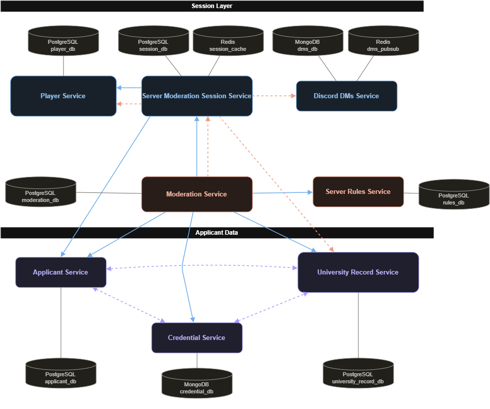

# TEAM 16's COURSE PROJECT - Student ID, please

This Common Public Repository (CPR) serves as a centralized documentation hub for the
FAF Discord Moderation game called **"Student ID, please"**

In accordance with course guidelines, each microservice source code is hosted in its
own isolated private repository accessible only to its assigned author and course professors.
This CPR contains submodules linking to those repositories and provides the global
service boundaries and communication architecture for the distributed system.

## Repo structure and Submodule Access

Due to repository permissions, cloing the CPR with submodules will only pull code for the services you personally own (or have professor-level permissions to read).

```
git clone https://github.com/your-org/faf-moderation-cpr.git

git submodule update --init --recursive
```

## Module ownership list

- Postoronca Dumitru: `player service` and `server moderation session service`;
- Iacovlev Maxim: `applicant service` and `credential service`;
- Racovita Dumitru: `moderation service` and `discord dm service`;
- Titerez Vladislav: `server rule service` and `university-record-service`;

## Service Boundaries

The system is decomposed following a data ownership principle: for every piece of state, exactly one service is the source of truth and the only service allowed to write it. Other services may read or trigger changes only through that owning service's API. This is why applicant-related data is split into three services (Applicant, Credential, University Record) rather than one - each owns a distinct category of data (identity, documents, hidden institutional records) with a different lifecycle and different access rules, even though they describe the same real-world person.

**Note on applicant initialization:** the topic allows any of Applicant, Credential, or University Record Service to be the first to encounter a new applicant. To keep this from turning into three services writing to each other's data, we resolve it as follows: whichever service is contacted first generates a shared `applicant_id` and publishes an `ApplicantInitialized` event carrying that ID plus the fields it was given. The other two services subscribe to this event and create their own record under the same `applicant_id`, populated only with the fields relevant to them. Each service still only ever writes its own record - there is no cross-service write, only event-driven record creation.

**Note on applicant assignment to sessions:** the topic does not specify how a session acquires its `current_applicant_id`. We resolve this as: when a Junior/Moderator player requests the next applicant, Server Moderation Session Service calls Applicant Service to generate or fetch the next applicant profile, and stores the returned `applicant_id` as `current_applicant_id` for that session.

**Note on scoped access assignment:** the topic specifies that access to University Record Service categories (enrollment, email-groups, courses, fcim-logs) is distributed among Junior Moderators within a session, but does not say who assigns it. We resolve this as: Server Moderation Session Service, which already assigns player roles when a session is formed, also assigns each Junior Moderator a subset of record categories at that same point, and passes this mapping to University Record Service so it can enforce access per `player_id` + `session_id`.

### 1. Player Service

- **Owns:** moderator player accounts - `player_id`, username, hashed credentials, email, profile, friends list, XP, level, moderation experience stats, shift history, disciplinary action log
- **Does NOT own:** any data about the people attempting to join the university server (that belongs entirely to the applicant-side services)
- **Interacts with:** Server Moderation Session Service, which reports shift results back so this service can update XP/level/disciplinary history

### 2. Server Moderation Session Service

- **Owns:** the moderation session/shift itself - `session_id`, assigned Moderator, assigned Junior Moderators, session status, `current_applicant_id`, number of applications processed, session score, penalties, start/end timestamps
- **Does NOT own:** applicant data, and does NOT make the admission decision - it only tracks that a decision is in progress and records the eventual outcome
- **Interacts with:** Player Service (reports shift results), Moderation Service (supplies the current applicant to trigger a decision, receives the outcome back), Discord DMs Service (supplies session membership so it can scope its own channels), Applicant Service (requests a new applicant profile per the assignment logic above), University Record Service (assigns each Junior Moderator's record-category scope when the session is formed)

### 3. Applicant Service

- **Owns:** the applicant's core identity - `applicant_id`, name, student ID, major, year, university status (FAF student / other-major student / TA / staff / alumni / outsider), enrolled courses, role
- **Does NOT own:** credential documents (Credential Service), hidden institutional records (University Record Service), or the admission decision (Moderation Service)
- **Interacts with:** Credential Service and University Record Service via the `ApplicantInitialized` event described above; Server Moderation Session Service (supplies a new applicant profile when requested); Moderation Service (supplies the base profile for a decision)

### 4. Credential Service

- **Owns:** the documents an applicant presents - student ID card, university email, enrollment confirmation, course registration proof - along with each document's validation status (valid / expired / forged / inconsistent / incomplete)
- **Does NOT own:** the applicant's identity profile, and does NOT decide whether the applicant is admitted - it only certifies whether the documents are structurally and logically sound
- **Interacts with:** Applicant Service and University Record Service (initialization event), Moderation Service (supplies validation results, not a verdict)

### 5. Server Rules Service

- **Owns:** the current, versioned ruleset for server access, which can be edited between shifts (e.g. "first-years cannot access #dark-memes", "must be enrolled 2+ years", "banned users are rejected regardless of credentials")
- **Does NOT own:** any applicant data, and does NOT issue the final admission decision - it only answers "does this applicant satisfy the current rules?" when asked
- **Interacts with:** Moderation Service, which queries it per applicant during a decision

### 6. University Record Service

- **Owns:** hidden institutional data - enrollment list, Outlook group email lists, existing course list, current academic year, semester schedule, FCIM server message records
- **Access control:** each record type is tagged by category (e.g. `enrollment`, `email-groups`, `courses`, `fcim-logs`). Within a session, each Junior Moderator is assigned a subset of categories they're permitted to query, per the scope assigned by Server Moderation Session Service; the service enforces this at the API level using `player_id` + `session_id`, and requests for a category outside a player's assignment are rejected
- **Does NOT own:** credential documents, and does NOT decide on admission, and does NOT assign the scope itself (Server Moderation Session Service does)
- **Interacts with:** Applicant Service and Credential Service (initialization event), Server Moderation Session Service (receives the per-player scope assignment), Moderation Service (supplies verification data, respecting the requesting player's scope)

### 7. Moderation Service

- **Owns:** the admission decision itself - `applicant_id`, decision (accept / reject / flag / ban), violated rules (if any), penalty, outcome, deciding moderator, timestamp
- **Does NOT own:** applicant identity, documents, or institutional records - it only consumes them, read-only, to reach and record a verdict
- **Interacts with:** Applicant, Credential, and University Record Services (gathers data for the decision), Server Rules Service (checks compliance), Server Moderation Session Service (receives the current applicant to evaluate, reports the outcome back)

### 8. Discord DMs Service

- **Owns:** real-time communication for a session - channels (e.g. `#enrollment-check`, `#faculty-check`, `#course-registration`, `#general-mod-chat`), messages (author, timestamp, channel, content), and per-player channel access mapping
- **Does NOT own:** the correctness of any information exchanged - it is a pure transport layer and never validates message content
- **Interacts with:** Server Moderation Session Service, which supplies session membership (who is in the session and their assigned roles); Discord DMs Service uses that membership data to scope its own channels and access mapping, but ownership of the channels and access mapping stays with Discord DMs Service

## Architecture Diagram

The diagram below visualizes the communication paths described above: the Session Layer (Player, Server Moderation Session, Discord DMs) coordinates around an active shift; the Applicant Data group (Applicant, Credential, University Record) stays loosely coupled through a shared `ApplicantInitialized` event instead of direct service-to-service calls; and Moderation Service sits at the center as the only consumer that reads from every data-owning service to produce a decision, which then flows back into the session.



---

## Technologies

### Languages

We use two languages: **Go** and **C#**.

| Language | Services | Owners |
| --- | --- | --- |
| Go | Player, Server Moderation Session, Applicant, Credential, Moderation, Discord DMs | Postoronca Dumitru, Iacovlev Maxim, Racovita Dumitru |
| C# | Server Rules, University Record | Titerez Vladislav |

**Why Go for six services.** Most of our services do the same kind of work: receive an HTTP request, call one or two other services, read or write their own database, and answer. Go is built for exactly this. It compiles to one small binary, starts in milliseconds, and goroutines make it simple to call several services at the same time (Moderation Service calls four at once). Go is also quick to learn, which matters because most of the team is picking it up during this course.

**Why C# for the rules and records services.** These two services are about data rules, not traffic. Server Rules answers "does this applicant satisfy rule version 7?" and University Record answers "may this player read the enrollment list?". C# has a strong type system and pattern matching that make such rules explicit in code, and ASP.NET Core has built-in policy-based authorization that expresses "player X may read category Y" directly. Their owner has the most C# experience in the team.

**Trade-off.** Two languages mean two toolchains, two sets of libraries and two ways to write a Dockerfile. We accept that because every service exposes the same interface (REST + JSON, RabbitMQ events), so a Go service and a C# service talk to each other in exactly the same way.

### Frameworks and libraries

| Purpose | Go | C# |
| --- | --- | --- |
| HTTP server | Gin | ASP.NET Core Web API |
| HTTP client | `net/http` | `HttpClient` |
| RabbitMQ | `rabbitmq/amqp091-go` | `RabbitMQ.Client` |
| WebSocket | `gorilla/websocket` (Discord DMs only) | not needed |
| PostgreSQL | `pgx` | Npgsql + EF Core |
| MongoDB | `mongo-go-driver` | `MongoDB.Driver` |
| Redis | `go-redis` | `StackExchange.Redis` |

Every service runs in its own Docker container. RabbitMQ runs as one shared container.

### Databases

**Rule: every service has its own database, and no service ever connects to another service's database.** Why this rule exists is explained in Communication Contract, Data Management.

We use three engines. PostgreSQL is the default. MongoDB and Redis are used only where there is a concrete reason.

| Service | Database | Engine | Why this engine |
| --- | --- | --- | --- |
| Player | `player_db` | PostgreSQL | Accounts, XP, shift history and the disciplinary log are tables with relations between them. When a shift ends, XP and history must update together, which needs a transaction. |
| Server Moderation Session | `session_db`, `session_cache` | PostgreSQL, Redis | History of shifts (who, when, score) goes to PostgreSQL. The state of the shift running right now (current applicant, counters) goes to Redis because it is read on every action and must be fast. |
| Applicant | `applicant_db` | PostgreSQL | Every applicant has the same fields (name, student ID, major, year, status, courses). A fixed structure is a table. |
| Credential | `credential_db` | MongoDB | Each applicant has a bundle of documents, and every document type has different fields. In a table this would be many empty columns. A document store keeps each bundle as one JSON document. |
| Server Rules | `rules_db` | PostgreSQL | Rulesets are versioned, and each shift records which version it used, so versions must be queryable. Rule conditions are stored as JSONB so a new rule type does not need a schema change. |
| University Record | `university_record_db` | PostgreSQL | Enrollment lists, email groups, courses and schedules are tables. Access control is a join between "records by category" and "which player may see which category in this session". |
| Moderation | `moderation_db` | PostgreSQL | Each decision is an audit record: who decided, what, whether it was correct, which rules were broken. Queried by session, moderator and applicant. Never changed after it is written. |
| Discord DMs | `dms_db`, `dms_pubsub` | MongoDB, Redis | Messages are appended and read back per channel in time order, which is what a Mongo collection with an index does. Redis Pub/Sub is not storage: it passes each new message to every running instance of the service so all connected players receive it. |

---

## Communication Patterns

Services talk to each other in three ways. Each way has one rule for when to use it.

### Rule 1. You need an answer right now: REST (HTTP + JSON)

Example: Session Service needs the next applicant before it can continue. It calls `POST /api/v1/applicants/next` on Applicant Service and waits for the reply.

Every service exposes a REST API. Services call each other through the same API a client would use. We chose REST over gRPC because JSON is easy to read, to test with curl or Postman, and to debug across two languages. gRPC would be faster, but nothing in Lab 0 needs that speed. If the four parallel calls of Moderation Service ever become a bottleneck, that path is the candidate for gRPC.

### Rule 2. Something happened and others should know, no reply needed: RabbitMQ event

Example: a shift ends. Session Service publishes one event, `session.ended`. Player Service reads it and updates XP. Discord DMs Service reads it and archives the channels. Session Service does not wait for either of them and does not need to know who is listening.

All events go through one RabbitMQ topic exchange. An event may be delivered twice, so every consumer remembers the `event_id` values it has seen and ignores repeats. This is what makes events safe: if Player Service is down for a minute, the event waits in the queue and XP is still awarded exactly once.

### Rule 3. The client must be pushed to: WebSocket (Discord DMs only)

Players chat in channels and must see new messages instantly. Discord DMs Service keeps one WebSocket connection open per player. No other service holds client connections. Channel lists and message history are also available over REST, so a client that reconnects can catch up.

### Every arrow in the diagram and the rule it follows

| Interaction | Rule | Who calls whom | Why this rule |
| --- | --- | --- | --- |
| Player creates or joins a session | REST | client → Session; Session → Player `GET /players/{id}` | Needs an answer now |
| Session reports shift results | Event `session.ended` | Session → Player | Player updates XP later; closing the shift must not wait for it |
| Session requests the next applicant | REST | Session → Applicant | Needs the `applicant_id` now |
| Applicant is initialized (`ApplicantInitialized` in Service Boundaries) | Event `applicant.initialized` | the service contacted first → the other two | Two listeners, no waiting, no cross-service writes |
| Session assigns record scopes to Junior Moderators | Event `session.started` | Session → University Record | Membership and scopes travel together in one event |
| Session supplies channel membership | Events `session.started`, `session.ended` | Session → Discord DMs | Discord DMs creates and archives channels on its own |
| Moderator submits a decision | REST `POST /decisions` | client → Moderation | The verdict must come back now |
| Session supplies the current applicant | REST `GET /sessions/{id}` | Moderation → Session | Moderation checks that the decision is about the current applicant |
| Moderation gathers data for the verdict | REST, four calls in parallel | Moderation → Applicant, Credential, University Record, Server Rules | All four answers are needed to compute the correct verdict |
| Moderation reports the outcome | Event `decision.recorded` | Moderation → Session | Session updates score and counters; no reply needed |
| Players chat during a shift | WebSocket (REST for history) | client ↔ Discord DMs | Push in real time |

### Worked example: one applicant from start to finish

1. The Moderator asks for the next applicant. Session calls Applicant over REST. Applicant Service creates the applicant and publishes `applicant.initialized`. Credential and University Record create their own records under the same `applicant_id`.
2. Junior Moderators look up records. The client calls University Record over REST. Each player only sees the categories assigned to them in `session.started`.
3. The team discusses in channels through Discord DMs over WebSocket.
4. The Moderator submits a decision with `POST /api/v1/decisions`. Moderation Service calls Session (is this the current applicant?), then Applicant, Credential, University Record and Server Rules in parallel, all over REST. It computes the correct verdict, compares it with the Moderator's choice, stores the decision and replies.
5. Moderation publishes `decision.recorded`. Session updates the score and counters.
6. The shift ends. Session publishes `session.ended`. Player updates XP and history; Discord DMs archives the channels.

**Note on University Record access.** A player's request is limited to the categories assigned to that player in the session. Moderation Service needs all categories to compute the correct verdict, so it calls University Record with an internal service token that has full read access. That token never reaches a client.

---

## Communication Contract

### Data Management

**Rule: one database per service, and only the owning service writes to it.** If a service needs data it does not own, it either calls the owner's REST API or listens to the owner's events. It never reads another service's tables.

Why:

- Service Boundaries say each piece of data has exactly one writer. With a shared database that is a promise; with separate databases it is enforced.
- Services must be deployable and scalable one by one in later laboratories. A shared schema ties every deploy to every other service.
- The data has different shapes: relational decisions and rules, document-shaped credentials and messages, cached shift state. One engine does not fit all of them well.

What it costs, and what we do about it:

- **Data that crosses a boundary through events arrives a little later.** Credential Service learns about a new applicant a few milliseconds after Applicant Service creates it. Consumers are idempotent and keyed by the shared identifier, so order and repeats do not matter.
- **No transaction can span two services.** A flow like "decision → session score → player XP" is a chain of events, not one transaction. Compensation for failures is a topic for the transactions laboratory.
- **No joins across services.** A service that needs a combined view asks each owner and combines the answers itself. Moderation Service does exactly this.

**Permitted duplication.** A service may keep a read-only copy of another service's data if it needs it for auditing or speed, as long as the owner stays the source of truth. Moderation Service stores a snapshot of the applicant, credentials and rule version behind each verdict, so the decision can still be explained after the applicant or the rules have changed.

**Shared identifiers.** `player_id`, `session_id`, `applicant_id`, `decision_id`, `channel_id` and `message_id` are UUID v4 strings. `applicant_id` is generated by whichever service initializes the applicant and is the same in Applicant, Credential and University Record.

#### Event catalog

Exchange `student-id.events`, type `topic`. Every event has the same envelope; only `payload` differs.

```json
{
  "event_id": "4f0c2a8e-1c3b-4d0e-9a6f-2b7e8c9d1a23",
  "event_type": "session.started",
  "occurred_at": "2026-09-09T14:32:10Z",
  "producer": "server-moderation-session-service",
  "version": 1,
  "payload": {}
}
```

| Routing key | Published by | Consumed by | Payload (key fields) |
| --- | --- | --- | --- |
| `applicant.initialized` | the first of Applicant, Credential, University Record to be contacted | the other two | `applicant_id`, `initialized_by`, profile fields known so far |
| `session.started` | Server Moderation Session | University Record, Discord DMs | `session_id`, `moderator_id`, `junior_moderators[] { player_id, record_scopes[] }`, `started_at` |
| `session.ended` | Server Moderation Session | Player, Discord DMs | `session_id`, `score`, `penalties`, `applications_processed`, `players[] { player_id, xp_delta, disciplinary_actions[] }`, `ended_at` |
| `decision.recorded` | Moderation | Server Moderation Session | `decision_id`, `session_id`, `applicant_id`, `moderator_id`, `action`, `is_correct`, `expected_action`, `violated_rules[]`, `penalty` |

#### API conventions

These apply to every endpoint listed in the next section.

- Base path `/api/v1`. Resource names are plural nouns. JSON fields are `snake_case`. Timestamps are ISO 8601 in UTC. Identifiers are UUID strings.
- Errors always look the same and use the matching HTTP status (400, 401, 403, 404, 409, 422, 500): `{ "error": { "code": "APPLICANT_NOT_FOUND", "message": "...", "details": {} } }`.
- Lists are paginated with `?limit=&offset=` and return `{ "items": [], "total": 0 }`.
- A request from a player carries the player's JWT. A request from another service carries a service token, so the receiver can tell the two apart (University Record relies on this).
- Every service exposes `GET /health`.

### Endpoints

_To be completed in issue #5: all endpoints per service with request and response formats, following the conventions above._

---

## Branch management

### Main branches

- `main` - production code, deployed on each release
- `dev` - branch that serves as a target for features, bug resolves, staging

### Branch protection rules

Branches are protected by following rules:

1. Protect main and dev - No direct push in `main` and `dev`. PR required. Branches cannot be deleted,
   updated or force pushed without the user being in bypass list
2. Enforce branch naming - We follow a standardized naming pattern for all feature branches:

```
type/issueID-short-description
```

### Branch Types

| Prefix      | Purpose                   | Example                           |
| ----------- | ------------------------- | --------------------------------- |
| `features/` | New functionality         | `features/23-user-authentication` |
| `bugs/`     | Bug fixes                 | `bugs/15-header-alignment`        |
| `hotfix/`   | Critical production fixes | `hotfix/18-server-crash`          |
| `chore/`    | Maintenance tasks         | `chore/9-dependency-updates`      |

### Naming Guidelines

- Use lowercase letters and hyphens
- Keep descriptions concise but descriptive
- Always include the related issue number

## Merge requirements

## Merging Strategy

**Strategy**: Squash and Merge

Benefits:

- Clean, linear commit history
- Combines all commits from a feature branch into a single commit
- Easier to track features and revert if necessary
- Reduces noise in the main branch history

Process:

1. Create feature branch from `dev`
2. Make commits with your work
3. Open Pull Request to `dev`
4. After approval, squash and merge
5. Delete feature branch after merge

## Pull Request Requirements

Every Pull Request must include:

### Required Information

- **Clear description** of what changed and why
- **Issue reference** (e.g., "Closes #42", "Fixes #18")
- **List of specific changes** made
- **Testing instructions** or results
- **Screenshots** for UI changes
- **Breaking changes** (if any)

### PR Template

We use the following template (located at `.github/PULL_REQUEST_TEMPLATE.md`):

```markdown
Closes #(issue)

# Changes

1.
2.
3.

## Additional Notes
```

## Testing Standards

- All new functions should have corresponding tests
- Existings tests will run as a githook
- Manual testing steps must be documented in PR
- GitHub Actions to be configured for automatic testing
- All PRs must pass automated tests before merging

## Versioning Strategy

We follow **Semantic Versioning (SemVer)**: `MAJOR.MINOR.PATCH`

### Version Types

- **MAJOR** (e.g., 1.0.0 → 2.0.0): Breaking changes that require user action
- **MINOR** (e.g., 1.0.0 → 1.1.0): New features that are backward compatible
- **PATCH** (e.g., 1.0.0 → 1.0.1): Bug fixes and small improvements

### Release Process

1. Update version in `package.json`
2. Create release notes documenting changes
3. Tag release in GitHub: `git tag v1.0.0`
4. Create GitHub Release with changelog
5. Deploy to production

### Release Notes Format

```markdown
## [1.2.0] - 2026-09-09

### Added

- User authentication system
- Dashboard analytics

### Changed

- Improved login flow UX
- Updated API endpoints

### Fixed

- Header alignment on mobile devices
- Memory leak in data processing

### Security

- Updated dependencies with security patches
```

## Workflow Summary

1. **Create Issue**: Document the feature/bug with clear requirements
2. **Create Branch**: Use proper naming convention from `dev` branch
3. **Develop**: Make commits with clear, descriptive messages
4. **Test**: Verify functionality and pass the tests
5. **Create PR**: Follow template and provide complete information
6. **Review**: Address feedback and get required approvals
7. **Merge**: Squash and merge to `dev`
8. **Deploy**: Regular releases from `dev` to `main`
