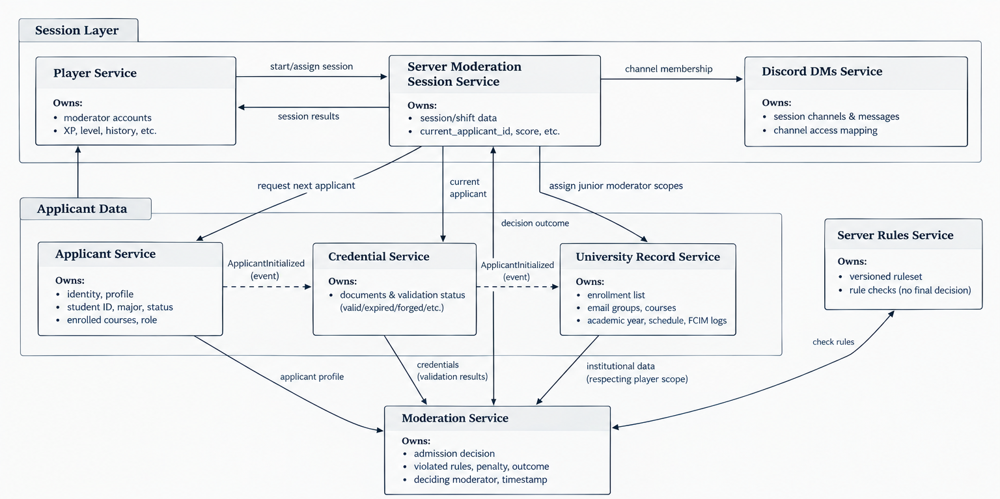

# TEAM 16's COURSE PROJECT - Student ID, please

This Common Public Repository (CPR) serves as a centralized documentation hub for the
FAF Discord Moderation game called **"Student ID, please"**

In accordance with course guidelines, each microservice source code is hosted in its
own isolated private repository accessible only to its assigned author and course professors.
This CPR contains submodules linking to those repositories and provides the global
service boundaries and communication architecture for the distributed system.

## Repo structure and Submodule Access

Due to repository permissions, cloing the CPR with submodules will only pull code for the services you personally own (or have professor-level permissions to read).

```
git clone https://github.com/your-org/faf-moderation-cpr.git

git submodule update --init --recursive
```

## Module ownership list

- Postoronca Dumitru: `player service` and `server moderation session service`;
- Iacovlev Maxim: `applicant service` and `credential service`;
- Racovita Dumitru: `moderation service` and `discord dm service`;
- Titerez Vladislav: `server rule service` and `university-record-service`;

## Service Boundaries

The system is decomposed following a data ownership principle: for every piece of state, exactly one service is the source of truth and the only service allowed to write it. Other services may read or trigger changes only through that owning service's API. This is why applicant-related data is split into three services (Applicant, Credential, University Record) rather than one - each owns a distinct category of data (identity, documents, hidden institutional records) with a different lifecycle and different access rules, even though they describe the same real-world person.

**Note on applicant initialization:** the topic allows any of Applicant, Credential, or University Record Service to be the first to encounter a new applicant. To keep this from turning into three services writing to each other's data, we resolve it as follows: whichever service is contacted first generates a shared `applicant_id` and publishes an `ApplicantInitialized` event carrying that ID plus the fields it was given. The other two services subscribe to this event and create their own record under the same `applicant_id`, populated only with the fields relevant to them. Each service still only ever writes its own record - there is no cross-service write, only event-driven record creation.

**Note on applicant assignment to sessions:** the topic does not specify how a session acquires its `current_applicant_id`. We resolve this as: when a Junior/Moderator player requests the next applicant, Server Moderation Session Service calls Applicant Service to generate or fetch the next applicant profile, and stores the returned `applicant_id` as `current_applicant_id` for that session.

**Note on scoped access assignment:** the topic specifies that access to University Record Service categories (enrollment, email-groups, courses, fcim-logs) is distributed among Junior Moderators within a session, but does not say who assigns it. We resolve this as: Server Moderation Session Service, which already assigns player roles when a session is formed, also assigns each Junior Moderator a subset of record categories at that same point, and passes this mapping to University Record Service so it can enforce access per `player_id` + `session_id`.

### 1. Player Service

- **Owns:** moderator player accounts - `player_id`, username, hashed credentials, email, profile, friends list, XP, level, moderation experience stats, shift history, disciplinary action log
- **Does NOT own:** any data about the people attempting to join the university server (that belongs entirely to the applicant-side services)
- **Interacts with:** Server Moderation Session Service, which reports shift results back so this service can update XP/level/disciplinary history

### 2. Server Moderation Session Service

- **Owns:** the moderation session/shift itself - `session_id`, assigned Moderator, assigned Junior Moderators, session status, `current_applicant_id`, number of applications processed, session score, penalties, start/end timestamps
- **Does NOT own:** applicant data, and does NOT make the admission decision - it only tracks that a decision is in progress and records the eventual outcome
- **Interacts with:** Player Service (reports shift results), Moderation Service (supplies the current applicant to trigger a decision, receives the outcome back), Discord DMs Service (supplies session membership so it can scope its own channels), Applicant Service (requests a new applicant profile per the assignment logic above), University Record Service (assigns each Junior Moderator's record-category scope when the session is formed)

### 3. Applicant Service

- **Owns:** the applicant's core identity - `applicant_id`, name, student ID, major, year, university status (FAF student / other-major student / TA / staff / alumni / outsider), enrolled courses, role
- **Does NOT own:** credential documents (Credential Service), hidden institutional records (University Record Service), or the admission decision (Moderation Service)
- **Interacts with:** Credential Service and University Record Service via the `ApplicantInitialized` event described above; Server Moderation Session Service (supplies a new applicant profile when requested); Moderation Service (supplies the base profile for a decision)

### 4. Credential Service

- **Owns:** the documents an applicant presents - student ID card, university email, enrollment confirmation, course registration proof - along with each document's validation status (valid / expired / forged / inconsistent / incomplete)
- **Does NOT own:** the applicant's identity profile, and does NOT decide whether the applicant is admitted - it only certifies whether the documents are structurally and logically sound
- **Interacts with:** Applicant Service and University Record Service (initialization event), Moderation Service (supplies validation results, not a verdict)

### 5. Server Rules Service

- **Owns:** the current, versioned ruleset for server access, which can be edited between shifts (e.g. "first-years cannot access #dark-memes", "must be enrolled 2+ years", "banned users are rejected regardless of credentials")
- **Does NOT own:** any applicant data, and does NOT issue the final admission decision - it only answers "does this applicant satisfy the current rules?" when asked
- **Interacts with:** Moderation Service, which queries it per applicant during a decision

### 6. University Record Service

- **Owns:** hidden institutional data - enrollment list, Outlook group email lists, existing course list, current academic year, semester schedule, FCIM server message records
- **Access control:** each record type is tagged by category (e.g. `enrollment`, `email-groups`, `courses`, `fcim-logs`). Within a session, each Junior Moderator is assigned a subset of categories they're permitted to query, per the scope assigned by Server Moderation Session Service; the service enforces this at the API level using `player_id` + `session_id`, and requests for a category outside a player's assignment are rejected
- **Does NOT own:** credential documents, and does NOT decide on admission, and does NOT assign the scope itself (Server Moderation Session Service does)
- **Interacts with:** Applicant Service and Credential Service (initialization event), Server Moderation Session Service (receives the per-player scope assignment), Moderation Service (supplies verification data, respecting the requesting player's scope)

### 7. Moderation Service

- **Owns:** the admission decision itself - `applicant_id`, decision (accept / reject / flag / ban), violated rules (if any), penalty, outcome, deciding moderator, timestamp
- **Does NOT own:** applicant identity, documents, or institutional records - it only consumes them, read-only, to reach and record a verdict
- **Interacts with:** Applicant, Credential, and University Record Services (gathers data for the decision), Server Rules Service (checks compliance), Server Moderation Session Service (receives the current applicant to evaluate, reports the outcome back)

### 8. Discord DMs Service

- **Owns:** real-time communication for a session - channels (e.g. `#enrollment-check`, `#faculty-check`, `#course-registration`, `#general-mod-chat`), messages (author, timestamp, channel, content), and per-player channel access mapping
- **Does NOT own:** the correctness of any information exchanged - it is a pure transport layer and never validates message content
- **Interacts with:** Server Moderation Session Service, which supplies session membership (who is in the session and their assigned roles); Discord DMs Service uses that membership data to scope its own channels and access mapping, but ownership of the channels and access mapping stays with Discord DMs Service

## Architecture Diagram

The diagram below visualizes the communication paths described above: the Session Layer (Player, Server Moderation Session, Discord DMs) coordinates around an active shift; the Applicant Data group (Applicant, Credential, University Record) stays loosely coupled through a shared `ApplicantInitialized` event instead of direct service-to-service calls; and Moderation Service sits at the center as the only consumer that reads from every data-owning service to produce a decision, which then flows back into the session.



---

## Technologies

The course requires the team to work in two different languages; we use exactly two, **Go** and **C#**, split along the architecture: the Session Layer and Moderation Service (orchestration, fan-out, real-time transport) are Go, the Applicant Data group and Server Rules Service (domain models, validation, access policies) are C#. Every service is a Docker container with the same external shape (REST + JSON, AMQP events), so the language boundary never leaks into the contract. The cost is two toolchains to maintain; the gain is the right tool per problem and a stack that each owner already knows or can pick up from a teammate.

| Service | Owner | Stack | Database | Why |
| --- | --- | --- | --- | --- |
| Player Service | Postoronca Dumitru | Go, Gin | PostgreSQL | Accounts, auth, XP, shift history and disciplinary log are relational and must be updated consistently. Go compiles to a small static binary with a fast startup, ideal for a service that every other flow authenticates against. |
| Server Moderation Session Service | Postoronca Dumitru | Go, Gin | PostgreSQL + Redis | Orchestrates a shift with many short calls and events; goroutines make concurrent calls and event publishing cheap and explicit. Redis holds hot state of the active shift (`current_applicant_id`, counters); PostgreSQL keeps shift history. Same language as Player keeps the Session Layer uniform. |
| Applicant Service | Iacovlev Maxim | C#, ASP.NET Core | PostgreSQL | Generating believable applicants and impostors is a data-generation task over a rich domain model (status, major, year, courses); C# records and the Bogus library give typed generation rules that are easy to tune between shifts. |
| Credential Service | Iacovlev Maxim | C#, ASP.NET Core | MongoDB | Documents differ in shape (ID card, email, enrollment, course registration) and each carries a validation status; a document store fits better than a fixed schema, and the official MongoDB C# driver maps documents to typed classes. Same language as the other Applicant Data services keeps that group uniform. |
| Server Rules Service | Titerez Vladislav | C#, ASP.NET Core | PostgreSQL | A versioned ruleset that grows more complex between shifts benefits from a strongly typed rule model and C# pattern matching. |
| University Record Service | Titerez Vladislav | C#, ASP.NET Core | PostgreSQL | Per-category access control per player maps directly onto ASP.NET Core policy-based authorization. |
| Moderation Service | Racovita Dumitru | Go, Gin | PostgreSQL | Fans out to four services in parallel (goroutines + `errgroup`), computes the correct verdict and compares it with the moderator's choice. Strong typing keeps the rule-evaluation logic explicit; decisions are audit records queried by session, moderator and applicant. |
| Discord DMs Service | Racovita Dumitru | Go, Gin + `gorilla/websocket` | MongoDB + Redis Pub/Sub | Real-time chat over WebSockets; one goroutine per connection keeps many idle connections cheap. Messages are append-only documents. Redis Pub/Sub fans messages out across instances so the service can scale horizontally later. Same language as Moderation Service keeps both services of one owner uniform. |

Shared by all services: Docker (one container per service), RabbitMQ as message broker, PostgreSQL as the default store, MongoDB and Redis only where the data shape or access pattern justifies them.

### Databases

Every service owns exactly one database instance that no other service connects to (see Data Management below). The engine is chosen per data shape and access pattern; instances are named `<service>_db` so they are easy to recognise in Docker Compose and in later replication and monitoring setups.

#### PostgreSQL

- Player Service `player_db`: a classic accounts store. Players, hashed credentials, friends, XP/levels, shift history and the disciplinary log are relational, and a level-up must be written in the same transaction as the shift that caused it.
- Server Moderation Session Service `session_db`: durable history of shifts, members, roles, scores and penalties. Sessions reference players and applicants by ID and are queried per player for progression, which is relational territory.
- Applicant Service `applicant_db`: applicant profiles share one strict structure (name, student ID, major, year, status, courses, role) and are queried by ID and by status, so a relational schema with constraints keeps generated data consistent.
- Server Rules Service `rules_db`: versioned rulesets; each shift references the version it was played under, and rules are queried by version and by channel. JSONB columns hold the rule conditions so new rule types do not require migrations.
- University Record Service `university_record_db`: enrollment, email groups, courses, academic year, schedule and FCIM logs are tabular institutional data, each tagged by category and joined with the per-session scope table to enforce access per `player_id` + `session_id`.
- Moderation Service `moderation_db`: decisions are audit records queried by session, moderator and applicant, and must be immutable once written. The snapshot of data behind a verdict is stored in a JSONB column next to the relational decision row.

#### MongoDB

- Credential Service `credential_db`: one document bundle per applicant, where each document type (student ID card, university email, enrollment confirmation, course registration) has different fields and its own validation status. A document store handles the heterogeneous shape without a sparse relational schema.
- Discord DMs Service `dms_db`: channels and append-only messages with author, timestamp and channel. Message history is fetched per channel in time order, which maps directly onto an indexed collection, and new message types need no schema change.

#### Redis

- Server Moderation Session Service `session_cache`: hot state of an active shift (`current_applicant_id`, applications processed, running score) that every decision touches. Sub-millisecond reads keep the shift loop fast; the durable copy lives in `session_db`.
- Discord DMs Service `dms_pubsub`: Pub/Sub only, no persisted data. Fans a message out to every service instance so clients connected to different instances see it, which is what makes the service horizontally scalable later.

---

## Communication Patterns

Three patterns, each with a rule for when it applies. Every arrow in the architecture diagram maps onto one of them.

**1. Synchronous request/response: REST over HTTP, JSON.** Used when the caller needs the answer to continue (next applicant, current session, rule check). Service-to-service calls use the same API the client would. We chose REST over gRPC because a single JSON contract across two languages is cheaper to build, debug and review than two Protobuf toolchains, and Lab 0 has no latency requirement that justifies binary serialization. gRPC remains a candidate for Moderation Service's internal fan-out in a later laboratory.

**2. Asynchronous domain events: RabbitMQ, topic exchange.** Used when the producer needs no reply and there are several consumers, or a consumer may be down (applicant initialized, shift started or ended, decision recorded). Delivery is at-least-once; every consumer is idempotent and deduplicates by `event_id`, so a redelivered event never double-applies XP, penalties or record creation. A broker fits the `ApplicantInitialized` flow from Service Boundaries exactly: one producer, two consumers, no cross-service writes. RabbitMQ over Kafka because we need routing and fan-out, not log replay, and it has first-class clients in both languages.

**3. Real-time push: WebSocket, only in Discord DMs Service.** Players wait for messages in session channels, so the client must be pushed to. Discord DMs is the only service holding long-lived client connections; history and channel lists are also available over REST so a reconnecting client can catch up.

Libraries per language, so that every service implements the same pattern the same way:

| Pattern | Go | C# |
| --- | --- | --- |
| REST server / client | Gin, `net/http` | ASP.NET Core Web API, `HttpClient` |
| RabbitMQ | `rabbitmq/amqp091-go` | `RabbitMQ.Client` |
| WebSocket | `gorilla/websocket` (Discord DMs only) | not used |

| Interaction (from the diagram) | Pattern | Direction | Why |
| --- | --- | --- | --- |
| Player creates or joins a session | REST | client → Session; Session → Player `GET /players/{id}` | Immediate answer required |
| Session reports shift results | Event `session.ended` | Session → Player | Progression must not block closing the shift; safe to retry |
| Session requests the next applicant | REST | Session → Applicant | `applicant_id` is needed immediately to store as `current_applicant_id` |
| Applicant initialization | Event `applicant.initialized` (`ApplicantInitialized`) | first-contacted service → the other two | Fan-out without cross-service writes, as in Service Boundaries |
| Session assigns record scopes to Junior Moderators | Event `session.started` | Session → University Record | Membership and `record_scopes` travel in one event; single source of truth for the shift |
| Session supplies channel membership | Events `session.started`, `session.ended` | Session → Discord DMs | Discord DMs creates and archives channels itself; no reply needed |
| Moderator submits a decision | REST `POST /decisions` | client → Moderation | The verdict (correct or not, violated rules, penalty) must return immediately |
| Session supplies the current applicant | REST `GET /sessions/{id}` | Moderation → Session | Moderation reads `current_applicant_id` and validates the decision against it |
| Moderation gathers data for the verdict | REST, four parallel calls | Moderation → Applicant, Credential, University Record, Server Rules | All four answers are needed to compute the correct verdict |
| Moderation reports the outcome | Event `decision.recorded` | Moderation → Session | Session updates counters, score and penalties |
| Players chat during a shift | WebSocket (+ REST for history) | client ↔ Discord DMs | Real-time push |

Note on University Record Service: player requests are scoped by `player_id` + `session_id`. Moderation Service needs every category to compute the reference verdict, so it calls University Record Service with an internal service token that bypasses player scoping. This path is never exposed to clients.

---

## Communication Contract

### Data Management

**One database per service.** No two services share a database or table, and no service reads another's tables. Data crosses a boundary only through the owner's REST API or the events it publishes.

Why: the Service Boundaries rest on "exactly one writer per piece of state", which a shared database can only promise, not enforce; services must deploy and scale independently in later laboratories; and the data shapes differ (relational decisions and rules, document-shaped credentials and messages, cached shift state).

Cost: eventual consistency where data is replicated through events (Credential Service learns about a new applicant milliseconds after Applicant Service does), handled by idempotent consumers keyed on the shared identifier; no distributed transactions in Lab 0, multi-service flows are event chains; and no cross-service joins, a service needing a composite view asks each owner and composes it (Moderation Service does exactly this).

| Service | Store | Holds |
| --- | --- | --- |
| Player Service | PostgreSQL | players, hashed credentials, profiles, friends, XP/levels, shift history, disciplinary log |
| Server Moderation Session Service | PostgreSQL, Redis | shifts, members, roles, scores, penalties; active-shift state (cache) |
| Applicant Service | PostgreSQL | applicant identity profiles |
| Credential Service | MongoDB | per-applicant document bundles with validation status |
| Server Rules Service | PostgreSQL | versioned rulesets |
| University Record Service | PostgreSQL | institutional records by category, per-session scope assignments |
| Moderation Service | PostgreSQL | decisions, violated rules, penalties, outcome, snapshot of the data used for the verdict |
| Discord DMs Service | MongoDB, Redis | channels, messages, channel access mapping; cross-instance message fan-out |

**Permitted duplication.** A service may keep a read-only copy of another service's data for auditability or performance, as long as the owner stays the source of truth. Moderation Service snapshots the applicant profile, credentials and rule version behind each verdict so the decision can be explained even after the applicant or rules change.

**Shared identifiers.** `player_id`, `session_id`, `applicant_id`, `decision_id`, `channel_id`, `message_id` are UUID v4 strings. `applicant_id` is generated by the initializing service and is identical across Applicant, Credential and University Record Services.

#### Event catalog

Exchange `student-id.events`, type `topic`. Every event shares the envelope below; `payload` differs per event.

```json
{
  "event_id": "4f0c2a8e-1c3b-4d0e-9a6f-2b7e8c9d1a23",
  "event_type": "session.started",
  "occurred_at": "2026-09-09T14:32:10Z",
  "producer": "server-moderation-session-service",
  "version": 1,
  "payload": {}
}
```

| Routing key | Producer | Consumers | Payload (key fields) |
| --- | --- | --- | --- |
| `applicant.initialized` | first-contacted of Applicant, Credential, University Record | the other two | `applicant_id`, `initialized_by`, profile fields known at that moment |
| `session.started` | Server Moderation Session | University Record, Discord DMs | `session_id`, `moderator_id`, `junior_moderators[] { player_id, record_scopes[] }`, `started_at` |
| `session.ended` | Server Moderation Session | Player, Discord DMs | `session_id`, `score`, `penalties`, `applications_processed`, `players[] { player_id, xp_delta, disciplinary_actions[] }`, `ended_at` |
| `decision.recorded` | Moderation | Server Moderation Session | `decision_id`, `session_id`, `applicant_id`, `moderator_id`, `action`, `is_correct`, `expected_action`, `violated_rules[]`, `penalty` |

#### API conventions

- Base path `/api/v1`, plural resource names, `snake_case` JSON fields, ISO 8601 UTC timestamps, UUID strings for identifiers.
- Errors use one envelope with a matching HTTP status (400, 401, 403, 404, 409, 422, 500): `{ "error": { "code": "APPLICANT_NOT_FOUND", "message": "...", "details": {} } }`.
- Collections are paginated with `?limit=&offset=` and return `{ "items": [], "total": 0 }`.
- Player requests carry the player's JWT; internal calls carry a service token, so a callee can tell a scoped player request from an unscoped internal one.
- Every service exposes `GET /health`.

### Endpoints

_To be completed in issue #5: all endpoints per service with request and response formats, following the conventions above._

---

## Branch management

### Main branches

- `main` - production code, deployed on each release
- `dev` - branch that serves as a target for features, bug resolves, staging

### Branch protection rules

Branches are protected by following rules:

1. Protect main and dev - No direct push in `main` and `dev`. PR required. Branches cannot be deleted,
   updated or force pushed without the user being in bypass list
2. Enforce branch naming - We follow a standardized naming pattern for all feature branches:

```
type/issueID-short-description
```

### Branch Types

| Prefix      | Purpose                   | Example                           |
| ----------- | ------------------------- | --------------------------------- |
| `features/` | New functionality         | `features/23-user-authentication` |
| `bugs/`     | Bug fixes                 | `bugs/15-header-alignment`        |
| `hotfix/`   | Critical production fixes | `hotfix/18-server-crash`          |
| `chore/`    | Maintenance tasks         | `chore/9-dependency-updates`      |

### Naming Guidelines

- Use lowercase letters and hyphens
- Keep descriptions concise but descriptive
- Always include the related issue number

## Merge requirements

## Merging Strategy

**Strategy**: Squash and Merge

Benefits:

- Clean, linear commit history
- Combines all commits from a feature branch into a single commit
- Easier to track features and revert if necessary
- Reduces noise in the main branch history

Process:

1. Create feature branch from `dev`
2. Make commits with your work
3. Open Pull Request to `dev`
4. After approval, squash and merge
5. Delete feature branch after merge

## Pull Request Requirements

Every Pull Request must include:

### Required Information

- **Clear description** of what changed and why
- **Issue reference** (e.g., "Closes #42", "Fixes #18")
- **List of specific changes** made
- **Testing instructions** or results
- **Screenshots** for UI changes
- **Breaking changes** (if any)

### PR Template

We use the following template (located at `.github/PULL_REQUEST_TEMPLATE.md`):

```markdown
Closes #(issue)

# Changes

1.
2.
3.

## Additional Notes
```

## Testing Standards

- All new functions should have corresponding tests
- Existings tests will run as a githook
- Manual testing steps must be documented in PR
- GitHub Actions to be configured for automatic testing
- All PRs must pass automated tests before merging

## Versioning Strategy

We follow **Semantic Versioning (SemVer)**: `MAJOR.MINOR.PATCH`

### Version Types

- **MAJOR** (e.g., 1.0.0 → 2.0.0): Breaking changes that require user action
- **MINOR** (e.g., 1.0.0 → 1.1.0): New features that are backward compatible
- **PATCH** (e.g., 1.0.0 → 1.0.1): Bug fixes and small improvements

### Release Process

1. Update version in `package.json`
2. Create release notes documenting changes
3. Tag release in GitHub: `git tag v1.0.0`
4. Create GitHub Release with changelog
5. Deploy to production

### Release Notes Format

```markdown
## [1.2.0] - 2026-09-09

### Added

- User authentication system
- Dashboard analytics

### Changed

- Improved login flow UX
- Updated API endpoints

### Fixed

- Header alignment on mobile devices
- Memory leak in data processing

### Security

- Updated dependencies with security patches
```

## Workflow Summary

1. **Create Issue**: Document the feature/bug with clear requirements
2. **Create Branch**: Use proper naming convention from `dev` branch
3. **Develop**: Make commits with clear, descriptive messages
4. **Test**: Verify functionality and pass the tests
5. **Create PR**: Follow template and provide complete information
6. **Review**: Address feedback and get required approvals
7. **Merge**: Squash and merge to `dev`
8. **Deploy**: Regular releases from `dev` to `main`
