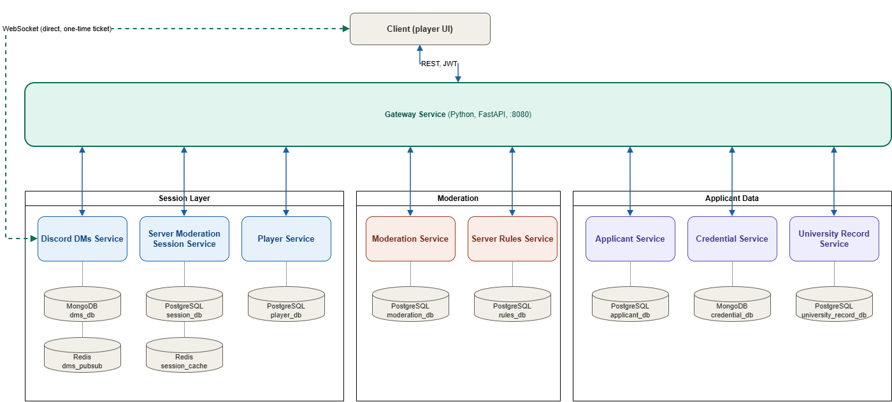

# TEAM 16's COURSE PROJECT - Student ID, please

This Common Public Repository (CPR) serves as a centralized documentation hub for the
FAF Discord Moderation game called **"Student ID, please"**

In accordance with course guidelines, each microservice source code is hosted in its
own isolated private repository accessible only to its assigned author and course professors.
This CPR contains submodules linking to those repositories and provides the global
service boundaries and communication architecture for the distributed system.

## Repo structure and Submodule Access

Due to repository permissions, cloning the CPR with submodules will only pull code for the services you personally own (or have professor-level permissions to read).

```
git clone https://github.com/DdimaPos/pad-team-16-student-id-please.git

git submodule update --init --recursive
```

## Module ownership list

- Postoronca Dumitru: `player service` and `server moderation session service`;
- Iacovlev Maxim: `applicant service` and `credential service`;
- Racovita Dumitru: `moderation service` and `discord dm service`;
- Titerez Vladislav: `server rule service` and `university-record-service`;
- Gateway (`gateway-service`): shared - the repository is owned by Iacovlev Maxim, every member contributes through PRs.

## Service Boundaries

The system is decomposed following a data ownership principle: for every piece of state, exactly one service is the source of truth and the only service allowed to write it. Other services may read or trigger changes only through that owning service's API. This is why applicant-related data is split into three services (Applicant, Credential, University Record) rather than one - each owns a distinct category of data (identity, documents, hidden institutional records) with a different lifecycle and different access rules, even though they describe the same real-world person.

Every interaction listed below passes through the [Gateway](#gateway): no service calls another service, and no client calls a service, directly. The Gateway itself owns no state (see [9. Gateway](#9-gateway)).

**Note on applicant initialization:** the topic allows any of Applicant, Credential, or University Record Service to be the first to encounter a new applicant. To keep this from turning into three services writing to each other's data, we resolve it as follows: whichever service is contacted first generates a shared `applicant_id` and pushes an `ApplicantInitialized` event carrying that ID plus the fields it was given to the other two services, which create their own record under the same `applicant_id`, populated only with the fields relevant to them. Each service still only ever writes its own record - there is no cross-service write, only event-driven record creation.

**Note on applicant assignment to sessions:** the topic does not specify how a session acquires its `current_applicant_id`. We resolve this as: when the Moderator requests the next applicant, Server Moderation Session Service calls Applicant Service to generate the next applicant profile, and stores the returned `applicant_id` as `current_applicant_id` for that session.

**Note on scoped access assignment:** the topic specifies that access to University Record Service categories (enrollment, email-groups, courses, fcim-logs) is distributed among Junior Moderators within a session, but does not say who assigns it. We resolve this as: Server Moderation Session Service, which already assigns player roles when a session is formed, also assigns each Junior Moderator a subset of record categories at that same point, and passes this mapping to University Record Service so it can enforce access per `player_id` + `session_id`.

### 1. Player Service

- **Owns:** moderator player accounts - `player_id`, username, hashed credentials, email, profile, friends list, XP, level, moderation experience stats, shift history, disciplinary action log - and issues the player login token (JWT) from those credentials
- **Does NOT own:** any data about the people attempting to join the university server (that belongs entirely to the applicant-side services)
- **Interacts with:** Server Moderation Session Service, which reads a player's profile and level when they create or join a session, and reports shift results back so this service can update XP/level/disciplinary history; the client, which logs in here to obtain its token

### 2. Server Moderation Session Service

- **Owns:** the moderation session/shift itself - `session_id`, assigned Moderator, assigned Junior Moderators and the record categories each of them may read, session status, shift difficulty, `ruleset_version` used by the shift, `current_applicant_id`, number of applications processed, session score, penalties, start/end timestamps
- **Does NOT own:** applicant data, and does NOT make the admission decision - it only tracks that a decision is in progress and records the eventual outcome
- **Interacts with:** Player Service (checks players and reads their level when they create or join a session, reports shift results), Server Rules Service (gets the ruleset for the shift when it starts), Moderation Service (Moderation reads the current applicant from it before recording a decision, and reports the outcome back), Discord DMs Service (supplies session membership so it can scope its own channels), Applicant Service (requests a new applicant profile per the assignment logic above), University Record Service (assigns each Junior Moderator's record-category scope when the session is formed)

### 3. Applicant Service

- **Owns:** the applicant's core identity - `applicant_id`, name, student ID, major, year, university status (FAF student / other-major student / TA / staff / alumni / outsider), enrolled courses, role
- **Does NOT own:** credential documents (Credential Service), hidden institutional records (University Record Service), or the admission decision (Moderation Service)
- **Interacts with:** Credential Service and University Record Service via the `ApplicantInitialized` event described above; Server Moderation Session Service (supplies a new applicant profile when requested); Moderation Service (supplies the base profile for a decision)

### 4. Credential Service

- **Owns:** the documents an applicant presents - student ID card, university email, enrollment confirmation, course registration proof - along with each document's validation status (valid / expired / forged / inconsistent / incomplete)
- **Does NOT own:** the applicant's identity profile, and does NOT decide whether the applicant is admitted - it only certifies whether the documents are structurally and logically sound
- **Interacts with:** Applicant Service and University Record Service (initialization event), Moderation Service (supplies validation results, not a verdict)

### 5. Server Rules Service

- **Owns:** the current, versioned ruleset for server access, which can be edited between shifts (e.g. "first-years cannot access #dark-memes", "must be enrolled 2+ years", "banned users are rejected regardless of credentials")
- **Does NOT own:** any applicant data, and does NOT issue the final admission decision - it only answers "does this applicant satisfy the current rules?" when asked
- **Interacts with:** Server Moderation Session Service, which gets the ruleset for each new shift, and Moderation Service, which asks it to evaluate each applicant during a decision

### 6. University Record Service

- **Owns:** hidden institutional data - enrollment list, Outlook group email lists, existing course list, current academic year, semester schedule, FCIM server message records
- **Access control:** each record type is tagged by category (e.g. `enrollment`, `email-groups`, `courses`, `fcim-logs`). Within a session, each Junior Moderator is assigned a subset of categories they're permitted to query, per the scope assigned by Server Moderation Session Service; the service enforces this at the API level using `player_id` + `session_id`, and requests for a category outside a player's assignment are rejected
- **Does NOT own:** credential documents, and does NOT decide on admission, and does NOT assign the scope itself (Server Moderation Session Service does)
- **Interacts with:** Applicant Service and Credential Service (initialization event), Server Moderation Session Service (receives the per-player scope assignment when a shift starts, and closes that access when the shift ends), Moderation Service (supplies verification data, respecting the requesting player's scope)

### 7. Moderation Service

- **Owns:** the admission decision itself - `applicant_id`, decision (accept / reject / flag / ban), violated rules (if any), penalty, outcome, deciding moderator, timestamp - and the ban list built from its own `ban` decisions
- **Does NOT own:** applicant identity, documents, or institutional records - it only consumes them, read-only, to reach and record a verdict
- **Interacts with:** Applicant, Credential, and University Record Services (gathers data for the decision), Server Rules Service (checks compliance), Server Moderation Session Service (reads the current applicant and the shift's ruleset version, reports the outcome back)

### 8. Discord DMs Service

- **Owns:** real-time communication for a session - channels (e.g. `#enrollment-check`, `#faculty-check`, `#course-registration`, `#general-mod-chat`), messages (author, timestamp, channel, content), and per-player channel access mapping
- **Does NOT own:** the correctness of any information exchanged - it is a pure transport layer and never validates message content
- **Interacts with:** Server Moderation Session Service, which supplies session membership (who is in the session and their assigned roles); Discord DMs Service uses that membership data to scope its own channels and access mapping, but ownership of the channels and access mapping stays with Discord DMs Service

### 9. Gateway

- **Owns:** no data. It holds only the routing table (prefix => service), the credential checks and the task timeout and concurrent task limit at the entry point of the system
- **Does NOT own:** any service's data, the player accounts or the issuing of tokens (Player Service), or the chat connection (Discord DMs Service carries it; the Gateway only negotiates it)
- **Interacts with:** every service, by forwarding each REST request to the service that owns the path; the client, as its single point of entry. See [Gateway](#gateway)

## Architecture Diagram



The diagram shows the system as it runs since Lab 2. A client reaches the system only through the **Gateway** (REST requests carrying the player's JWT), and the Gateway is connected to each of the eight services, which sit in three groups:

- **Session Layer:** Discord DMs, Server Moderation Session and Player.
- **Moderation:** Moderation Service and Server Rules Service.
- **Applicant Data:** Applicant, Credential and University Record.

Each blue line between the Gateway and a service is two-way and stands for both kinds of traffic: the REST calls a service receives or makes, and the events pushed as `POST /api/v1/<service>/events`. No service has a line to another service, because none addresses another directly; a call from one service to another leaves through the Gateway and comes back through it. Which service calls which, and with which rule, is listed in [Every arrow in the diagram](#every-arrow-in-the-diagram-and-the-rule-it-follows).

The green dashed line is the one path that does not run through the Gateway: the chat WebSocket. The client first asks the Gateway for a one-time ticket and a WebSocket URL (see [Gateway](#gateway)), then connects to Discord DMs Service directly, so the Gateway is not kept busy carrying the chat.

Each service owns its database, drawn beneath it, and no database is shared: Player, Session, Moderation, Server Rules, Applicant and University Record use PostgreSQL, Credential uses MongoDB, Session adds a Redis cache, and Discord DMs uses MongoDB for messages and Redis for Pub/Sub. There is no message broker.

---

## Technologies

### Languages

The eight services use two languages, **Go** and **C#**. The Gateway, added in Lab 2, is written in **Python** - the language the lab requires for it.

| #   | Service                           | Owner              | Language | Framework                 |
| --- | --------------------------------- | ------------------ | -------- | ------------------------- |
| 1   | Player Service                    | Postoronca Dumitru | Go       | Gin                       |
| 2   | Server Moderation Session Service | Postoronca Dumitru | Go       | Gin                       |
| 3   | Applicant Service                 | Iacovlev Maxim     | Go       | Gin                       |
| 4   | Credential Service                | Iacovlev Maxim     | Go       | Gin                       |
| 5   | Server Rules Service              | Titerez Vladislav  | C#       | ASP.NET Core              |
| 6   | University Record Service         | Titerez Vladislav  | C#       | ASP.NET Core              |
| 7   | Moderation Service                | Racovita Dumitru   | Go       | Gin                       |
| 8   | Discord DMs Service               | Racovita Dumitru   | Go       | Gin + `gorilla/websocket` |
| 9   | Gateway                           | whole team         | Python   | FastAPI + `httpx`         |

**Why Go for six services.** Most of our services do the same kind of work: receive an HTTP request, call one or two other services, read or write their own database, and answer. Go is built for exactly this. It compiles to one small binary, starts in milliseconds, and goroutines make it simple to call several services at the same time (Moderation Service calls four at once). Go is also quick to learn, which matters because most of the team is picking it up during this course.

**Why C# for the rules and records services.** These two services are about data rules, not traffic. Server Rules answers "does this applicant satisfy rule version 7?" and University Record answers "may this player read the enrollment list?". C# has a strong type system and pattern matching that make such rules explicit in code, and ASP.NET Core has built-in policy-based authorization that expresses "player X may read category Y" directly. Their owner has the most C# experience in the team.

**Trade-off.** Two languages mean two toolchains, two sets of libraries and two ways to write a Dockerfile. We accept that because every service exposes the same interface (REST + JSON, with events delivered as plain HTTP requests), so a Go service and a C# service talk to each other in exactly the same way.

### Frameworks and libraries

| Purpose     | Go                                     | C#                    |
| ----------- | -------------------------------------- | --------------------- |
| HTTP server | Gin                                    | ASP.NET Core Web API  |
| HTTP client | `net/http`                             | `HttpClient`          |
| WebSocket   | `gorilla/websocket` (Discord DMs only) | not needed            |
| PostgreSQL  | `pgx`                                  | Npgsql + EF Core      |
| MongoDB     | `mongo-go-driver`                      | `MongoDB.Driver`      |
| Redis       | `go-redis`                             | `StackExchange.Redis` |

Every service runs in its own Docker container. There is no message broker: services call each other directly.

### Databases

**Rule: every service has its own database, and no service ever connects to another service's database.** Why this rule exists is explained in Communication Contract, Data Management.

We use three engines. PostgreSQL is the default. MongoDB and Redis are used only where there is a concrete reason.

| Service                   | Database                      | Engine            | Why this engine                                                                                                                                                                                                                                            |
| ------------------------- | ----------------------------- | ----------------- | ---------------------------------------------------------------------------------------------------------------------------------------------------------------------------------------------------------------------------------------------------------- |
| Player                    | `player_db`                   | PostgreSQL        | Accounts, XP, shift history and the disciplinary log are tables with relations between them. When a shift ends, XP and history must update together, which needs a transaction.                                                                            |
| Server Moderation Session | `session_db`, `session_cache` | PostgreSQL, Redis | History of shifts (who, when, score) goes to PostgreSQL. The state of the shift running right now (current applicant, counters) goes to Redis because it is read on every action and must be fast.                                                         |
| Applicant                 | `applicant_db`                | PostgreSQL        | Every applicant has the same fields (name, student ID, major, year, status, courses). A fixed structure is a table.                                                                                                                                        |
| Credential                | `credential_db`               | MongoDB           | Each applicant has a bundle of documents, and every document type has different fields. In a table this would be many empty columns. A document store keeps each bundle as one JSON document.                                                              |
| Server Rules              | `rules_db`                    | PostgreSQL        | Rulesets are versioned, and each shift records which version it used, so versions must be queryable. Rule conditions are stored as JSONB so a new rule type does not need a schema change.                                                                 |
| University Record         | `university_record_db`        | PostgreSQL        | Enrollment lists, email groups, courses and schedules are tables. Access control is a join between "records by category" and "which player may see which category in this session".                                                                        |
| Moderation                | `moderation_db`               | PostgreSQL        | Each decision is an audit record: who decided, what, whether it was correct, which rules were broken. Queried by session, moderator and applicant. Never changed after it is written.                                                                      |
| Discord DMs               | `dms_db`, `dms_pubsub`        | MongoDB, Redis    | Messages are appended and read back per channel in time order, which is what a Mongo collection with an index does. Redis Pub/Sub is not storage: it passes each new message to every running instance of the service so all connected players receive it. |

---

## Communication Patterns

Every REST request goes through the **Gateway**: a client calling a service, and a service calling another service, alike. A caller never addresses a service directly; it addresses `{gateway}/api/v1/<service>/...` and the Gateway forwards the request to that service as `/api/v1/...` (see [Gateway](#gateway)). On that common path, services talk to each other in three ways. Each way has one rule for when to use it.

### Rule 1. You need an answer right now: REST (HTTP + JSON)

Example: Session Service needs the next applicant before it can continue. It calls `POST {gateway}/api/v1/applicant/applicants/next`; the Gateway forwards it to Applicant Service as `POST /api/v1/applicants/next`, and Session waits for the reply.

Every service exposes a REST API, and services call each other through the same API a client would use, through the same Gateway. We chose REST over gRPC because JSON is easy to read, to test with curl or Postman, and to debug across three languages. gRPC would be faster, but nothing in Lab 0 needs that speed. If the four parallel calls of Moderation Service ever become a bottleneck, that path is the candidate for gRPC.

### Rule 2. Something happened and others should know, no reply needed: event, pushed over HTTP

Example: a shift ends. Session Service produces one event, `session.ended`, and pushes it to Player, Discord DMs and University Record. Player Service updates XP, Discord DMs archives the channels. Closing the shift does not wait for any of them.

There is no broker. The producer writes the event to its own outbox table in the same database transaction as the change it announces, and a background relay sends it to every consumer listed in the [event catalog](#event-catalog) - through the Gateway, as `POST {gateway}/api/v1/<consumer>/events` - retrying until each one accepts it. An event may therefore be delivered twice, so every consumer remembers the `event_id` values it has seen and ignores repeats. This is what makes events safe: if Player Service is down for a minute, the event waits in Session's outbox and XP is still awarded exactly once. The full delivery rules are under [Event delivery](#event-delivery).

### Rule 3. The client must be pushed to: WebSocket (Discord DMs only)

Players chat in channels and must see new messages instantly. Discord DMs Service keeps one WebSocket connection open per player. No other service holds client connections. The connection is **negotiated through the Gateway but not carried by it**: the client asks the Gateway for a connection, gets back a WebSocket URL with a one-time ticket, and connects to Discord DMs Service directly, so the Gateway is not kept busy in the middle of every chat (see [`POST /api/v1/ws-tickets`](#post-apiv1ws-tickets---consumed-by-client)). Channel lists and message history are also available over REST, through the Gateway, so a client that reconnects can catch up.

### Every arrow in the diagram and the rule it follows

"`A => GW => B`" means A calls the Gateway, which forwards to B. Paths are the service's own paths; through the Gateway they carry the service prefix (`/api/v1/player/...`).

| Interaction                                                             | Rule                                        | Who calls whom                                                       | Why this rule                                                                                              |
| ----------------------------------------------------------------------- | ------------------------------------------- | -------------------------------------------------------------------- | ---------------------------------------------------------------------------------------------------------- |
| Player logs in                                                          | REST `POST /auth/login`                     | client => GW => Player                                               | The client needs a token before anything else                                                              |
| Player creates or joins a session                                       | REST                                        | client => GW => Session; Session => GW => Player `GET /players/{id}` | Needs an answer now                                                                                        |
| Session reports shift results                                           | Event `session.ended`                       | Session => GW => Player, University Record `POST /events`            | Player updates XP later; closing the shift must not wait for it                                            |
| Session picks the ruleset for a new shift                               | REST `GET /rulesets/current`                | Session => GW => Server Rules                                        | The shift cannot start without knowing its `ruleset_version`                                               |
| Session requests the next applicant                                     | REST                                        | Session => GW => Applicant                                           | Needs the `applicant_id` now                                                                               |
| Applicant is initialized (`ApplicantInitialized` in Service Boundaries) | Event `applicant.initialized`               | the service contacted first => GW => the other two `POST /events`    | Two listeners, no waiting, no cross-service writes                                                         |
| Session assigns record scopes to Junior Moderators                      | Event `session.started`                     | Session => GW => University Record `POST /events`                    | Membership and scopes travel together in one event                                                         |
| Session supplies channel membership                                     | Events `session.started`, `session.ended`   | Session => GW => Discord DMs `POST /events`                          | Discord DMs creates and archives channels on its own                                                       |
| Moderator submits a decision                                            | REST `POST /decisions`                      | client => GW => Moderation                                           | The verdict must come back now                                                                             |
| Session supplies the current applicant                                  | REST `GET /sessions/{id}`                   | Moderation => GW => Session                                          | Moderation checks that the decision is about the current applicant and reads the shift's `ruleset_version` |
| Moderation gathers data for the verdict                                 | REST, three calls in parallel               | Moderation => GW => Applicant, Credential, University Record         | All three answers are needed to know what is true about the applicant                                      |
| Moderation checks the rules                                             | REST `POST /rulesets/{version}/evaluations` | Moderation => GW => Server Rules                                     | Needs the verified facts from the three calls above, so it comes after them                                |
| Moderation reports the outcome                                          | Event `decision.recorded`                   | Moderation => GW => Session `POST /events`                           | Session updates score and counters; no reply needed                                                        |
| A player opens the chat                                                 | REST `POST /ws-tickets`, then WebSocket     | client => GW => Discord DMs (ticket); client ↔ Discord DMs (socket)  | The Gateway authorizes the connection but does not carry it                                                |
| Players chat during a shift                                             | WebSocket (REST for history)                | client ↔ Discord DMs; history client => GW => Discord DMs            | Push in real time                                                                                          |

### Worked example: one applicant from start to finish

Every request below passes through the Gateway, which checks the caller's credential before forwarding (see [Authentication](#authentication)).

0. Each player logs in through Player Service and receives a JWT; the client sends it with every request.
1. The Moderator asks for the next applicant. Session calls Applicant over REST. Applicant Service creates the applicant and pushes `applicant.initialized` to Credential and University Record, which create their own records under the same `applicant_id`.
2. Junior Moderators look up records. The client calls University Record over REST. Each player only sees the categories assigned to them in `session.started`.
3. The team discusses in channels: each client obtains a ticket through the Gateway and holds a WebSocket open directly to Discord DMs.
4. The Moderator submits a decision with `POST /api/v1/decisions`. Moderation Service calls Session (is this the current applicant, and which ruleset does the shift use?), then Applicant, Credential and University Record in parallel. From the records it builds the verified facts and sends them to Server Rules. All calls are REST. It computes the correct verdict, compares it with the Moderator's choice, stores the decision and replies.
5. Moderation pushes `decision.recorded` to Session. Session updates the score and counters.
6. The shift ends. Session pushes `session.ended` to Player, Discord DMs and University Record. Player updates XP and history; Discord DMs archives the channels; University Record closes the juniors' access.

**Note on University Record access.** A player's request is limited to the categories assigned to that player in the session. Moderation Service needs all categories to compute the correct verdict, so it calls University Record's service-only endpoint with the service token. The Gateway checks that token and strips it; University Record recognises the service call by the route and by the absence of `X-Player-Id` (see [Authentication](#authentication)). The token never reaches a client.

---

## Communication Contract

### Data Management

**Rule: one database per service, and only the owning service writes to it.** If a service needs data it does not own, it either calls the owner's REST API or listens to the owner's events. It never reads another service's tables.

Why:

- Service Boundaries say each piece of data has exactly one writer. With a shared database that is a promise; with separate databases it is enforced.
- Services must be deployable and scalable one by one in later laboratories. A shared schema ties every deploy to every other service.
- The data has different shapes: relational decisions and rules, document-shaped credentials and messages, cached shift state. One engine does not fit all of them well.

What it costs, and what we do about it:

- **Data that crosses a boundary through events arrives a little later.** Credential Service learns about a new applicant a few milliseconds after Applicant Service creates it. Consumers are idempotent and keyed by the shared identifier, so order and repeats do not matter.
- **No transaction can span two services.** A flow like "decision => session score => player XP" is a chain of events, not one transaction. Compensation for failures is a topic for the transactions laboratory.
- **No joins across services.** A service that needs a combined view asks each owner and combines the answers itself. Moderation Service does exactly this.

**Permitted duplication.** A service may keep a read-only copy of another service's data if it needs it for auditing or speed, as long as the owner stays the source of truth. Moderation Service stores a snapshot of the applicant, credentials and rule version behind each verdict, so the decision can still be explained after the applicant or the rules have changed.

**Shared identifiers.** `player_id`, `session_id`, `applicant_id`, `decision_id`, `channel_id` and `message_id` are UUID v4 strings. `ruleset_version` is an integer that grows by one with every new ruleset - within one deployment: wiping Server Rules Service's database resets the counter to 1, which silently invalidates any `ruleset_version` a peer (Moderation Service) has snapshotted from before the reset. Do not drop that volume between demos. `applicant_id` is generated by whichever service initializes the applicant and is the same in Applicant, Credential and University Record.

#### Event catalog

Every event has the same envelope; only `payload` differs.

```json
{
  "event_id": "4f0c2a8e-1c3b-4d0e-9a6f-2b7e8c9d1a23",
  "event_type": "session.started",
  "occurred_at": "2026-09-09T14:32:10Z",
  "producer": "server-moderation-session-service",
  "version": 1,
  "payload": {}
}
```

| `event_type`            | Produced by                                                           | Pushed to                              | Payload (key fields)                                                                                                                        |
| ----------------------- | --------------------------------------------------------------------- | -------------------------------------- | ------------------------------------------------------------------------------------------------------------------------------------------- |
| `applicant.initialized` | the first of Applicant, Credential, University Record to be contacted | the other two                          | `applicant_id`, `session_id`, `initialized_by`, `difficulty`, `claimed`, `actual` (each an [applicant profile](#shared-values) itself, not an object with a `profile` key)                                   |
| `session.started`       | Server Moderation Session                                             | University Record, Discord DMs         | `session_id`, `moderator_id`, `junior_moderators[] { player_id, record_scopes[] }`, `ruleset_version`, `started_at`                         |
| `session.ended`         | Server Moderation Session                                             | Player, Discord DMs, University Record | `session_id`, `score`, `penalties`, `applications_processed`, `players[] { player_id, role, xp_delta, disciplinary_actions[] }`, `ended_at` |
| `decision.recorded`     | Moderation                                                            | Server Moderation Session              | `decision_id`, `session_id`, `applicant_id`, `moderator_id`, `action`, `is_correct`, `expected_action`, `violated_rules[]`, `penalty`       |

`role` in `session.ended` is `moderator` or `junior_moderator`. A consumer that does not need it ignores it.

#### Event delivery

Events travel from the producer to each consumer over HTTP, through the Gateway like every other REST request. There is no broker.

**Producer side.**

1. The event is written to the producer's own outbox table **in the same database transaction** as the state change it announces, so an event never exists without its change, nor the reverse.
2. A background relay sends the envelope, unchanged, to **every consumer listed in the catalog above** as `POST {gateway}/api/v1/<consumer>/events`, with the service token (see [Authentication](#authentication)). The producer is configured with each consumer's Gateway URL; the variable names are each service's own and are listed in its `docs/` reference.
3. Delivery state is tracked per consumer: one consumer being down never holds back the others.
4. The answer - the consumer's, or the Gateway's when it could not reach the consumer - decides what happens next:

| Answer                                                                                                        | Producer does                                                      |
| ------------------------------------------------------------------------------------------------------------- | ------------------------------------------------------------------ |
| `2xx`                                                                                                         | Marks the event delivered to that consumer                         |
| `422 INVALID_EVENT`                                                                                           | Parks it for that consumer and logs it - a retry cannot succeed    |
| Any other `4xx` (`408`, `429`, `502` from the Gateway included), any `5xx`, a timeout or a refused connection | Retries later with backoff (capped at 30 s), until it gets a `2xx` |

The Gateway forwards each push **once** and never retries it on the producer's behalf; retrying is the producer relay's job alone, so the two never multiply.

**Consumer side - `POST /api/v1/events`.** Every service that consumes at least one event exposes this one endpoint (reached as `{gateway}/api/v1/<consumer>/events`).

- **Payload:** the envelope. **Auth:** service token only, checked by the Gateway.
- **Response:** `200 OK` with `{ "event_id": "...", "duplicate": false }`. A repeat of an `event_id` already applied answers `200` with `"duplicate": true` and changes nothing - a repeat is the dedup working, not an error.
- The consumer records the `event_id` **in the same transaction** as the change the event causes, and answers `2xx` only after that transaction commits.
- `422 INVALID_EVENT` when the envelope cannot be parsed, its `event_type` is not one this service consumes, its `version` is unknown to this service, or its payload fails validation.
- `500` for a failure that may succeed later (its own database is down); the producer will retry.

**Guarantees.** Delivery is at-least-once: a crash between a successful push and the outbox update sends the event again. There is **no ordering guarantee** between events, even from one producer: a consumer must cope, for example, with `session.ended` arriving before `session.started`.

**Versions.** `version` in the envelope is bumped by one for a breaking payload change of that event. Consumers reject a version they do not know with `422 INVALID_EVENT`.

#### Gateway

The Gateway is the single entry point of the system (Lab 2). Clients **and services** send every REST request to it; nothing calls a service directly. It owns no data and produces no events. Its own reference is [`docs/GATEWAY.md`](docs/GATEWAY.md).

**Address.** Container `gateway-service`, port `8080` inside `student-id-net` (`http://gateway-service:8080`), published on host port `8080`.

**Route scheme.** `{gateway}/api/v1/<prefix>/<rest>` is forwarded to the service behind `<prefix>` as `/api/v1/<rest>` - the prefix segment is removed, so every service keeps the paths documented under [Endpoints](#endpoints). Example: `GET {gateway}/api/v1/server-rules/rulesets/current?difficulty=3` reaches `GET http://server-rules-service:8080/api/v1/rulesets/current?difficulty=3`. The prefix also tells apart paths that exist in several services (`POST /applicants/next`, `POST /events`, `/health`).

| Prefix              | Service                           | Forwarded to                            |
| ------------------- | --------------------------------- | --------------------------------------- |
| `player`            | Player Service                    | `http://player-service:8080`            |
| `session`           | Server Moderation Session Service | `http://session-service:8080`           |
| `applicant`         | Applicant Service                 | `http://applicant-service:8081`         |
| `credential`        | Credential Service                | `http://credential-service:8082`        |
| `server-rules`      | Server Rules Service              | `http://server-rules-service:8080`      |
| `university-record` | University Record Service         | `http://university-record-service:8080` |
| `moderation`        | Moderation Service                | `http://moderation-service:8085`        |
| `discord-dms`       | Discord DMs Service               | `http://discord-dms-service:8086`       |

A service's own health check is `{gateway}/api/v1/<prefix>/health` (forwarded to `/health`). The Gateway's own is `GET {gateway}/health`.

**Forwarding.** Method, path remainder, query string and body are forwarded unchanged. The status, headers and body of the service's answer are returned unchanged - a service's own errors reach the caller as the service wrote them. The Gateway changes only the credential headers (see [Authentication](#authentication)) and adds `X-Request-ID` when the caller sent none.

**What the Gateway answers itself**, always in the shared error envelope:

| Situation                                                    | Answer                                                |
| ------------------------------------------------------------ | ----------------------------------------------------- |
| Unknown prefix                                               | `404 NOT_FOUND`                                       |
| Missing or unusable credential, wrong service token          | `401` / `403` - see [Authentication](#authentication) |
| The service is unreachable (connection refused, DNS failure) | `502 BAD_GATEWAY`                                     |
| The service did not answer within the Gateway's timeout      | `408 REQUEST_TIMEOUT`                                 |
| The Gateway's own concurrent task limit is reached           | `429 TOO_MANY_REQUESTS`                               |

In all of these the request either never reached the service or its answer was lost; callers treat `408`, `429` and `502` as "may be retried", except for the non-idempotent `POST`s listed under [API conventions](#api-conventions).

**No retries.** The Gateway forwards a request once. It never retries on its own, so a non-idempotent call such as `POST /applicants/next` is never duplicated by it.

**Development and admin routes.** Paths under `/api/v1/<prefix>/dev/*` and `/api/v1/<prefix>/admin/*` are beyond the contract. The Gateway forwards them only with a valid service token, never on a player token alone.

#### API conventions

These apply to every endpoint listed in the next section.

- Base path `/api/v1` inside every service; through the Gateway, `/api/v1/<prefix>` (see [Gateway](#gateway)). Resource names are plural nouns. JSON fields are `snake_case`. Timestamps are ISO 8601 in UTC. Identifiers are UUID strings.
- Lists are paginated with `?limit=&offset=` and return `{ "items": [], "total": 0 }`.
- A `POST` that creates something (`POST /applicants/next`, `POST /sessions`, `POST /decisions`) is not idempotent. Callers must not retry it automatically on a timeout, and the Gateway never does.
- Every service exposes `GET /health`. It needs no credential.

##### Authentication

Credentials are checked **at the Gateway, and only there**. Services never see the caller's token.

**What callers send to the Gateway** - each request carries exactly one credential:

| Caller            | Header                        | Meaning                                                                                                 |
| ----------------- | ----------------------------- | ------------------------------------------------------------------------------------------------------- |
| A player (client) | `Authorization: Bearer <jwt>` | A JWT issued by Player Service's [`POST /api/v1/auth/login`](#post-apiv1authlogin---consumed-by-client) |
| Another service   | `X-Service-Token: <token>`    | One shared secret, the same value in every service and the Gateway (`SERVICE_TOKEN` in `.env`)          |

**The JWT.** Signed with HS256 using the shared secret `JWT_SECRET`, known only to Player Service (which signs) and the Gateway (which verifies). Claims: `sub` = the player's `player_id` (UUID), `iat`, `exp`. The Gateway rejects a token with a bad signature, an expired `exp` or a non-UUID `sub`.

**What the Gateway does before forwarding:**

1. A request to a public route (below) is forwarded without a credential check.
2. Otherwise it validates the credential the route accepts (table below). Missing, unusable or expired player token: `401 UNAUTHENTICATED`. Wrong service token: `401 INVALID_SERVICE_TOKEN`. A service-only route without a service token: `403 SERVICE_TOKEN_REQUIRED`. In all three cases no service is called.
3. It **removes** `Authorization` and `X-Service-Token`, and removes any `X-Player-Id` the caller sent.
4. For a request authenticated with a player token, it sets **`X-Player-Id: <sub>`**. A request authenticated with the service token carries no `X-Player-Id`.

**What services receive.** Only `X-Player-Id`. When an endpoint needs to know which player is calling, it reads that header and nothing else; a service validates no token. A request without `X-Player-Id` on a route that needs a calling player answers `401 UNAUTHENTICATED`. Services trust the header because nothing but the Gateway can reach them - their ports are not published (see [Deployments](#deployments)). The one connection that bypasses the Gateway, the Discord DMs WebSocket, is authorized with a one-time ticket instead (see [`POST /api/v1/ws-tickets`](#post-apiv1ws-tickets---consumed-by-client)).

**A service calling another service** sends `X-Service-Token`, never a player's token or a player's `X-Player-Id`.

**Public routes** (no credential): `POST /api/v1/player/auth/login`, `POST /api/v1/player/players` (registration, beyond the contract), `GET /health` of the Gateway and `GET /api/v1/<prefix>/health`.

Which credential each contract endpoint accepts, enforced by the Gateway:

| Accepts                | Endpoints                                                                                                                                                                                                                                           |
| ---------------------- | --------------------------------------------------------------------------------------------------------------------------------------------------------------------------------------------------------------------------------------------------- |
| **None (public)**      | `POST /auth/login` (Player), the health checks                                                                                                                                                                                                      |
| **Service token only** | `POST /applicants/next` (Applicant, Credential, University Record), `GET /applicants/{id}/documents/validation`, `GET /applicants/{id}/records`, `GET /rulesets/current`, `POST /rulesets/{version}/evaluations`, `POST /events` (every consumer)   |
| **Player or service**  | `GET /players/{id}`, `GET /sessions/{id}`, `GET /applicants/{id}` (Applicant)                                                                                                                                                                       |
| **Player only**        | every other contract endpoint: the session actions, `GET /applicants/{id}/documents`, `GET /rulesets/{version}`, `GET /records/{category}`, `POST`/`GET /decisions`, `GET /bans`, `POST /ws-tickets`, the Discord DMs channel and message endpoints |

`GET /ws` (Discord DMs) is not reached through the Gateway at all; it takes a ticket.

##### Errors

Every error has the same body and uses the matching HTTP status - from a service and from the Gateway alike:

```json
{ "error": { "code": "APPLICANT_NOT_FOUND", "message": "...", "details": {} } }
```

`details` is always an object, never `null`. `message` is for humans; clients branch on `code` only.

These codes are shared by every service and the Gateway, and mean the same everywhere. "Who" says who answers them:

| Status | `code`                   | Who                                             | When                                                                                                                                                  |
| ------ | ------------------------ | ----------------------------------------------- | ----------------------------------------------------------------------------------------------------------------------------------------------------- |
| `400`  | `VALIDATION_ERROR`       | service, Gateway                                | Anything malformed: a body that is not JSON or misses a field, a path id that is not a UUID, a bad query parameter. `details` names the field         |
| `401`  | `UNAUTHENTICATED`        | Gateway (service when `X-Player-Id` is missing) | A route that needs a calling player got no valid player token: missing, malformed, bad signature, expired                                             |
| `401`  | `INVALID_SERVICE_TOKEN`  | Gateway                                         | `X-Service-Token` is present but wrong                                                                                                                |
| `401`  | `INVALID_CREDENTIALS`    | Player Service                                  | `POST /auth/login` only: unknown username or wrong password                                                                                           |
| `403`  | `SERVICE_TOKEN_REQUIRED` | Gateway                                         | A service-only route was called without `X-Service-Token`                                                                                             |
| `404`  | `NOT_FOUND`              | service, Gateway                                | No such route, or (Gateway) no such prefix. A missing resource uses its own code (`SESSION_NOT_FOUND`, ...)                                           |
| `405`  | `METHOD_NOT_ALLOWED`     | service, Gateway                                | Known path, wrong method                                                                                                                              |
| `408`  | `REQUEST_TIMEOUT`        | service, Gateway                                | The task ran longer than the [task timeout](#task-timeout-and-concurrent-task-limit) and was stopped. **Nothing was changed**                         |
| `422`  | `INVALID_EVENT`          | service                                         | `POST /events` only - see [Event delivery](#event-delivery)                                                                                           |
| `429`  | `TOO_MANY_REQUESTS`      | service, Gateway                                | The [concurrent task limit](#task-timeout-and-concurrent-task-limit) is reached. **Nothing was changed.** Comes with `Retry-After` (seconds)          |
| `500`  | `DEPENDENCY_UNAVAILABLE` | service                                         | A service or database this endpoint needs did not answer, or answered `408`/`429`/`502`/`5xx`. **Nothing was changed.** `details.dependency` names it |
| `500`  | `INTERNAL_ERROR`         | service, Gateway                                | Anything else                                                                                                                                         |
| `502`  | `BAD_GATEWAY`            | Gateway                                         | The service behind the prefix is unreachable                                                                                                          |

- `422` is reserved for the endpoint-specific codes listed under each endpoint (`INVALID_DIFFICULTY`, `MODERATOR_NOT_IN_SESSION`, ...): the request is well-formed, but its content is not acceptable. A malformed request is always `400 VALIDATION_ERROR`, never `422`.
- `409` is for a request that is valid but conflicts with the current state (`SESSION_NOT_IN_LOBBY`, `ALREADY_DECIDED`, ...).
- A service that gets a contract error code from a peer it calls may pass it on unchanged (Session passes on `404 PLAYER_NOT_FOUND`). Any other failure of a peer - including the Gateway's `408`, `429` and `502` - becomes `500 DEPENDENCY_UNAVAILABLE`.

##### Task timeout and concurrent task limit

Every service and the Gateway bound how long one task may run and how many may run at once (Lab 2). A **task** is one inbound HTTP request, `POST /events` included. Background work (the outbox relay) is not counted; it already backs off on its own.

| Setting               | Variable               | Default                                 | When reached                                                                            |
| --------------------- | ---------------------- | --------------------------------------- | --------------------------------------------------------------------------------------- |
| Task timeout          | `HTTP_REQUEST_TIMEOUT` | `5s` in a service, `10s` in the Gateway | The task is cancelled, its transaction rolled back: `408 REQUEST_TIMEOUT`               |
| Concurrent task limit | `MAX_CONCURRENT_TASKS` | chosen per service                      | A new task is refused at once, before any work: `429 TOO_MANY_REQUESTS` + `Retry-After` |

- **The outer layer never gives up first:** client timeout > Gateway timeout (`10s`) > service timeout (`5s`) > that service's timeout for its own outgoing calls. A service that calls peers sets its outgoing timeout below its own `HTTP_REQUEST_TIMEOUT`, so it can still answer `500 DEPENDENCY_UNAVAILABLE` before its own deadline.
- **Health endpoints are exempt** from the concurrent limit, so a busy service is not restarted by its orchestrator.
- The variable names are shared. The C# services read the same names from the environment, or map them to their own configuration keys and say so in their `docs/` reference.

### Endpoints

For every service this section lists three things: the endpoints it **calls** in other services, the endpoints it **offers**, and the **events** it produces or receives. Paths, field names and errors follow the API conventions above.

**Paths are the service's own.** Every caller - client or service - reaches them through the Gateway with the service's prefix: `GET /api/v1/players/{player_id}` of Player Service is called as `GET {gateway}/api/v1/player/players/{player_id}`. See [Gateway](#gateway).

How to read it:

- **Client** means the player's game client. Only the client endpoints that start or feed a flow between services are listed here, plus login, which every flow needs. Other account features (register, friends, profile editing) are beyond the contract.
- **Who is calling.** When an endpoint needs to know which player is calling (for example, "only the Moderator may do this"), it reads the `player_id` from the `X-Player-Id` header the Gateway sets after validating the player's JWT, as [Authentication](#authentication) says. That player is called "the calling player" below. Which credential each endpoint accepts is fixed in the same section.
- **Errors.** Each endpoint lists only its own error codes. The shared codes in [Errors](#errors) (`400 VALIDATION_ERROR`, `401`, `403 SERVICE_TOKEN_REQUIRED`, `408`, `429`, `500 DEPENDENCY_UNAVAILABLE`, ...) can come from any endpoint and are not repeated.
- **Events** always use the common envelope from the event catalog, so only the `payload` is shown. "Pushed to X" means the producer sends it to X's `POST /api/v1/events`, through the Gateway, as described in [Event delivery](#event-delivery); a consumer's `POST /api/v1/events` is not repeated under its exposed endpoints.
- `GET /health` exists in every service and is not repeated below.

#### Shared values

These values are used by more than one service, so they are defined once here.

| Field                                                  | Allowed values                                                                                                                                                                         |
| ------------------------------------------------------ | -------------------------------------------------------------------------------------------------------------------------------------------------------------------------------------- |
| `university_status`                                    | `faf_student`, `other_major_student`, `teaching_assistant`, `staff`, `alumni`, `outsider`                                                                                              |
| `role` (the server role an applicant asks for)         | `student`, `teacher`, `alumni`, `guest`                                                                                                                                                |
| document `type`                                        | `student_id_card`, `university_email`, `enrollment_confirmation`, `course_registration`                                                                                                |
| document `validation_status`                           | `valid`, `expired`, `forged`, `inconsistent`, `incomplete`                                                                                                                             |
| record `category`                                      | `enrollment` (enrollment list and current academic year), `email-groups` (Outlook group lists), `courses` (existing courses and semester schedule), `fcim-logs` (FCIM server messages) |
| decision `action`                                      | `accept`, `reject`, `flag`, `ban`                                                                                                                                                      |
| session `status`                                       | `lobby` (players are joining), `active` (the shift is running), `ended`                                                                                                                |
| server channels (what an accepted applicant may enter) | `general`, `dark-memes`, `groapa`, `teachers`, `alumni`; a ruleset may add more                                                                                                        |
| moderator channels (in Discord DMs)                    | `general-mod-chat`, `enrollment-check`, `faculty-check`, `course-registration`                                                                                                         |
| `difficulty`                                           | integer from `1` (easy) to `5` (hard)                                                                                                                                                  |
| course `code`                                          | 2-4 uppercase letters, `^[A-Z]{2,4}$` (`POO`, `SDA`, `PAD`). The identifier of a course everywhere - see [Courses](#courses)                                                           |
| email `groups`                                         | `{major}-students` (`faf-students`, `ia-students`, ...), the academic group `{major}-{yy}{g}` derived from the student ID (`faf-231`), `teaching-assistants`, `staff`, `alumni`        |

**Applicant profile.** This is the shape of what an applicant says about themselves. It is used by Applicant Service and inside the `applicant.initialized` event (both `claimed` and `actual` have this shape):

```json
{
  "name": "Ion Popescu",
  "student_id": "FAF23117",
  "email": "ion.popescu@isa.utm.md",
  "major": "FAF",
  "year": 4,
  "university_status": "faf_student",
  "courses": ["PAD", "SIS"],
  "role": "student"
}
```

#### Identity model

Applicant, Credential and University Record all generate or validate the same identity, so
the rules are defined once here. A service that disagrees with them turns an honest applicant
into an apparent liar.

**Student ID - `{MAJOR}{yy}{g}{nn}`**

```
FAF 23 1 17   ->  "FAF23117"
 |   |  |  `- nn : 2 digits, index within the group
 |   |  `---- g  : 1 digit,  group number
 |   `------- yy : 2 digits, admission year mod 100 (23 = admitted 2023)
 `----------- MAJOR : 2-4 uppercase letters, equal to the profile's major
```

Regex `^[A-Z]{2,4}[0-9]{5}$`. The academic group is derivable from the identifier alone -
`FAF23117` => group `FAF-231`, email group `faf-231` - so it never has to travel as a separate
field. `enrollment` records still carry `group` for display, but it must agree with the
identifier. Parsers are deliberately tolerant: a service never rejects a peer's identifier for
its shape, it only declines to interpret it.

**`REFERENCE_YEAR` is `2026`.** It is the calendar year the applicant-data services treat as
"now". Applicant, Credential, University Record and Moderation (which derives `years_enrolled`
from it) must all be configured with the same value, or perfectly honest applicants will look
like liars. It matches the first component of `academic_year` (`"2026-2027"`).

**Admission year and study year are independent.** Neither is derived from the other: in the
spring of 2026 someone admitted in 2025 is a first-year, and in the autumn of the same calendar
year a second-year. The pair is constrained rather than computed:

```
year ∈ { REFERENCE_YEAR − admissionYear, REFERENCE_YEAR − admissionYear + 1 } ∩ [1, 4]
```

So someone admitted in 2023 is in year 3 or 4 during `2026-2027` and **never** in year 2, and
claiming otherwise is a lie provable from the identifier on their own card. The `years_enrolled`
fact Moderation sends to Server Rules is `REFERENCE_YEAR − admissionYear`.

**University email addresses are numbered only on collision.**

| Status                                                     | Address                    | Suffix                                               |
| ---------------------------------------------------------- | -------------------------- | ---------------------------------------------------- |
| `faf_student`, `other_major_student`, `teaching_assistant` | `first.last@isa.utm.md`    | none, unless taken => `first.last2@`, `first.last3@` |
| `staff`                                                    | `first.last@utm.md`        | the same rule                                        |
| `alumni`, `outsider`                                       | `first.last{nn}@gmail.com` | always a two-digit suffix                            |

`first.last` is lower-cased and folded to ASCII: `Ștefan Băț` => `stefan.bat`, `Ana-Maria Rusu`
=> `ana-maria.rusu`. Uniqueness is asked across all three applicant-data services, and any one
of them can answer it locally: each holds the union of the applicants it generated and every
applicant it ingested from `applicant.initialized`, and registers the addresses of both.

**Which fields each status carries.** `role` is not chosen freely - it follows from
`university_status`, and is the server role that status entitles the applicant to ask for.

| `university_status`                  | `student_id` | `major` | `year`  | `courses` | `role`    |
| ------------------------------------ | ------------ | ------- | ------- | --------- | --------- |
| `faf_student`, `other_major_student` | yes          | yes     | `1`-`4` | may have  | `student` |
| `teaching_assistant`                 | yes          | yes     | `1`-`4` | may have  | `teacher` |
| `alumni`                             | yes          | yes     | `null`  | empty     | `alumni`  |
| `staff`                              | `null`       | `null`  | `null`  | empty     | `teacher` |
| `outsider`                           | `null`       | `null`  | `null`  | empty     | `guest`   |

An alumnus is the case the old one-line rule got wrong: they carry a student ID and a major,
but no current study year and no course registrations.

##### Courses

A course is identified by its `code` alone: 2-4 uppercase letters (`^[A-Z]{2,4}$`), the
abbreviation of a lecture in the study programme (`POO`, `SDA`, `PAD`). Every service matches,
stores and searches courses by `code`; `title` and any other descriptive data (description,
professor, schedule) is informative only and may differ slightly between services.

The catalog is [`shared/courses.json`](shared/courses.json) in this repository - one row per
lecture of a programme:

```json
{
  "code": "POO",
  "title": "Programarea Orientată pe Obiecte",
  "major": "FAF",
  "year": 2,
  "semester": "autumn"
}
```

- The same `code` under several majors (`SDA` for FAF, IA and SC) is one course that belongs to
  several curricula.
- A `courses` list in a profile holds codes from the catalog rows of that person's own `major`
  and `year`. A code outside them is a lie that the catalog alone can prove.
- **Every service that generates or verifies courses - Applicant, Credential and University
  Record - ships a byte-identical copy of this file.** A change to it is a contract change for all
  three at once, like `REFERENCE_YEAR`.
- A fabricated course (a liar claiming a lecture that does not exist) uses a code in the **same
  format** (`QBIT`), so it is not visible at a glance, and never one that is in the catalog. Each
  generating service keeps its own list of such codes; they are not shared.

#### Player Service

##### Consumed API endpoints

None. Player Service never calls other services; it only receives `session.ended`.

##### Exposed API endpoints

###### `GET /api/v1/players/{player_id}` - consumed by Server Moderation Session Service, Client

**Description.** Returns the public part of a player's profile. Session Service calls it when a player creates or joins a session, to make sure the player exists and to read their level. Session uses the levels to decide how hard the shift will be.

**Payload.** None.

**Response.** `200 OK`

```json
{
  "player_id": "8c1f6a2e-5b7d-4e1a-9c3f-2d4b6a8e0f11",
  "username": "dima_mod",
  "level": 4,
  "xp": 1250,
  "completed_shifts": 12
}
```

`404 PLAYER_NOT_FOUND` if no player has this ID.

**Usage.** Private data (email, password hash, friends list, disciplinary log) is never returned here.

###### `POST /api/v1/auth/login` - consumed by Client

**Description.** Exchanges a player's username and password for the JWT every other request needs. Player Service owns the credentials, so it is the token issuer. Public route: reached as `POST {gateway}/api/v1/player/auth/login` without any credential.

**Payload.**

```json
{
  "username": "dima_mod",
  "password": "..."
}
```

**Response.** `200 OK`

```json
{
  "access_token": "<jwt>",
  "token_type": "Bearer",
  "expires_in": 3600
}
```

**Usage.**

- The token is signed with HS256 using `JWT_SECRET`, shared only with the Gateway. Claims: `sub` = `player_id`, `iat`, `exp` (`expires_in` seconds later). See [Authentication](#authentication).
- The client sends it as `Authorization: Bearer <access_token>` on every later request. The Gateway validates it and passes the player on as `X-Player-Id`; no service ever sees the token.
- Errors: `401 INVALID_CREDENTIALS` for an unknown username or a wrong password - the same code for both, so the answer does not reveal which usernames exist.

###### Level and XP

`level` is derived from `xp`, never stored: `level = xp / 400 + 1`, capped at 10. The step and the
cap are configurable (`XP_PER_LEVEL`, `MAX_LEVEL`) but the defaults are what this document's example
above assumes - 1250 XP is level 4. Player Service owns this rule; no other service should
reimplement it. Session Service reads `level` from this endpoint and clamps the _average_ to 1-5 to
pick a `difficulty`, which is a separate calculation on its side.

A total XP is floored at zero, so the minimum level is always 1.

###### Endpoints beyond this contract

Player Service also exposes register, list, profile read/edit, delete, shift history, disciplinary
log and friends endpoints, plus a development endpoint (`GET /api/v1/dev/slow`) that demonstrates the
task timeout and the concurrent task limit. They are not part of this contract and may change without
amending it - see [`docs/PLAYER_SERVICE.md`](docs/PLAYER_SERVICE.md). No endpoint returns a player's
email.

##### Events

**Produced:** none.

**Received:**

- `session.ended` - from Server Moderation Session Service  
  For every player in `players[]`, adds `xp_delta` to their XP, recalculates their level, adds the shift to their history and appends any `disciplinary_actions` to their log. The `event_id` is remembered, so the same shift is never counted twice.

  An id in `players[]` with no account here is skipped and logged - Session Service decides who was
  in a shift, and one unknown id must not cost the other players their XP.

#### Server Moderation Session Service

##### Consumed API endpoints

- `GET /api/v1/players/{player_id}` - available in Player Service, via `{gateway}/api/v1/player`  
  Checks that the player exists and reads their level when they create or join a session.
- `GET /api/v1/rulesets/current?difficulty={n}` - available in Server Rules Service, via `{gateway}/api/v1/server-rules`  
  Picks the ruleset when the shift starts. The returned `version` is stored in the session and used for the whole shift.
- `POST /api/v1/applicants/next` - available in Applicant Service, via `{gateway}/api/v1/applicant`  
  Creates the next applicant. The returned `applicant_id` becomes the session's `current_applicant_id`.
- `POST /api/v1/events` - available in University Record, Discord DMs and Player Service, via `{gateway}/api/v1/<consumer>`  
  Pushes `session.started` (University Record, Discord DMs) and `session.ended` (Player, Discord DMs,
  University Record), as described in [Event delivery](#event-delivery).

##### Exposed API endpoints

Several endpoints below return the **session object**:

```json
{
  "session_id": "3a7e9b1c-2d4f-4b6a-8c0e-1f2a3b4c5d6e",
  "status": "active",
  "created_by": "8c1f6a2e-5b7d-4e1a-9c3f-2d4b6a8e0f11",
  "players": [
    {
      "player_id": "8c1f6a2e-5b7d-4e1a-9c3f-2d4b6a8e0f11",
      "username": "dima_mod",
      "level": 4
    },
    {
      "player_id": "b2d4f6a8-1c3e-4a5b-9d7f-0e2c4a6b8d10",
      "username": "maxim_jr",
      "level": 2
    },
    {
      "player_id": "c3e5a7b9-2d4f-4b6c-8e0a-1f3b5d7f9a21",
      "username": "vlad_jr",
      "level": 3
    }
  ],
  "moderator_id": "8c1f6a2e-5b7d-4e1a-9c3f-2d4b6a8e0f11",
  "junior_moderators": [
    {
      "player_id": "b2d4f6a8-1c3e-4a5b-9d7f-0e2c4a6b8d10",
      "record_scopes": ["enrollment", "courses"]
    },
    {
      "player_id": "c3e5a7b9-2d4f-4b6c-8e0a-1f3b5d7f9a21",
      "record_scopes": ["email-groups", "fcim-logs"]
    }
  ],
  "difficulty": 3,
  "ruleset_version": 7,
  "current_applicant_id": "5d2c8e4a-7b1f-4c3d-9e6a-0b8f2d4c6e13",
  "current_applicant_decided": false,
  "applications_processed": 5,
  "score": 40,
  "penalties": 10,
  "created_at": "2026-09-10T18:00:00Z",
  "started_at": "2026-09-10T18:05:00Z",
  "ended_at": null
}
```

While the session is in the `lobby`, `moderator_id`, `ruleset_version` and `current_applicant_id` are `null` and `junior_moderators` is empty.

###### `POST /api/v1/sessions` - consumed by Client

**Description.** The calling player opens a new session. The session starts in the `lobby`, and this player is its first member and its creator.

**Payload.** None (empty body).

**Response.** `201 Created` with the session object (`status: "lobby"`).

**Usage.** Session first calls `GET /api/v1/players/{player_id}` in Player Service. Errors: `404 PLAYER_NOT_FOUND`, and `409 PLAYER_ALREADY_IN_SESSION` if the player is already in a lobby or an active session.

###### `POST /api/v1/sessions/{session_id}/players` - consumed by Client

**Description.** The calling player joins a session that is still in the lobby.

**Payload.** None (empty body).

**Response.** `200 OK` with the updated session object.

**Usage.** As with creating a session, the player is checked in Player Service first. A session holds at most 5 players (1 Moderator and up to 4 Junior Moderators). Errors: `404 SESSION_NOT_FOUND`, `404 PLAYER_NOT_FOUND`, `409 SESSION_NOT_IN_LOBBY`, `409 SESSION_FULL`, `409 PLAYER_ALREADY_IN_SESSION`.

###### `POST /api/v1/sessions/{session_id}/start` - consumed by Client

**Description.** The creator starts the shift. Session assigns the roles, splits the record categories between the Junior Moderators, picks the ruleset and produces `session.started`.

**Payload.**

```json
{
  "moderator_id": "8c1f6a2e-5b7d-4e1a-9c3f-2d4b6a8e0f11"
}
```

`moderator_id` must be one of the session's players. Everyone else becomes a Junior Moderator.

**Response.** `200 OK` with the session object (`status: "active"`).

**Usage.**

- Only the creator can start the session, and at least 2 players are needed (a Moderator and one Junior Moderator).
- `difficulty` is the average level of the players, rounded and kept between 1 and 5. Session sends it to `GET /api/v1/rulesets/current` and stores the returned `version` as `ruleset_version`.
- The four record categories are handed out in turn: with 4 juniors each gets one category, with 2 juniors each gets two, and with 3 juniors one of them gets two. The Moderator gets no category.
- If Server Rules does not answer, the session stays in the lobby.
- Errors: `403 NOT_SESSION_CREATOR`, `409 SESSION_NOT_IN_LOBBY`, `409 NOT_ENOUGH_PLAYERS`, `422 MODERATOR_NOT_IN_SESSION`.

###### `POST /api/v1/sessions/{session_id}/applicants/next` - consumed by Client

**Description.** The Moderator asks for the next applicant. Session calls `POST /api/v1/applicants/next` in Applicant Service, stores the new `applicant_id` as `current_applicant_id` and returns it. The client then reads the profile from Applicant Service and the documents from Credential Service.

**Payload.** None (empty body).

**Response.** `201 Created`

```json
{
  "session_id": "3a7e9b1c-2d4f-4b6a-8c0e-1f2a3b4c5d6e",
  "current_applicant_id": "5d2c8e4a-7b1f-4c3d-9e6a-0b8f2d4c6e13",
  "applications_processed": 5
}
```

**Usage.**

- Only the session's Moderator can ask for the next applicant.
- A new applicant is given only when the current one already has a decision. Session learns about decisions through the `decision.recorded` event, which can arrive a moment after the Moderator got the reply from Moderation Service. So, right after a decision, this endpoint may answer `409 CURRENT_APPLICANT_NOT_DECIDED`; the client waits briefly and tries again.
- Errors: `403 NOT_MODERATOR`, `409 SESSION_NOT_ACTIVE`, `409 CURRENT_APPLICANT_NOT_DECIDED`.

###### `POST /api/v1/sessions/{session_id}/end` - consumed by Client

**Description.** The Moderator ends the shift. Session works out the result (final score, penalties, XP for every player, disciplinary actions), stores it and produces `session.ended`.

**Payload.** None (empty body).

**Response.** `200 OK`

```json
{
  "session_id": "3a7e9b1c-2d4f-4b6a-8c0e-1f2a3b4c5d6e",
  "status": "ended",
  "score": 40,
  "penalties": 10,
  "applications_processed": 6,
  "players": [
    {
      "player_id": "8c1f6a2e-5b7d-4e1a-9c3f-2d4b6a8e0f11",
      "role": "moderator",
      "xp_delta": 30,
      "disciplinary_actions": [
        {
          "type": "warning",
          "reason": "Accepted an applicant with a forged student ID"
        }
      ]
    },
    {
      "player_id": "b2d4f6a8-1c3e-4a5b-9d7f-0e2c4a6b8d10",
      "role": "junior_moderator",
      "xp_delta": 40,
      "disciplinary_actions": []
    }
  ],
  "ended_at": "2026-09-10T18:45:00Z"
}
```

**Usage.** If the current applicant has no decision yet, that applicant is dropped and does not count. Session decides how XP and disciplinary actions are calculated. Player Service only applies the result it receives in `session.ended`. Errors: `403 NOT_MODERATOR`, `409 SESSION_NOT_ACTIVE`.

###### `GET /api/v1/sessions/{session_id}` - consumed by Moderation Service, Client

**Description.** Returns the current state of a session. Before recording a decision, Moderation Service uses it to check four things: the session is active, the calling player is its Moderator, the applicant is the current one, and which `ruleset_version` the shift uses.

**Payload.** None.

**Response.** `200 OK` with the session object. `404 SESSION_NOT_FOUND` if the session does not exist.

##### Events

**Produced:**

- `session.started` - pushed to University Record Service, Discord DMs Service  
  A shift has started. University Record learns which categories each junior may read, and Discord DMs learns who is in the session so it can create the channels.

  ```json
  {
    "session_id": "3a7e9b1c-2d4f-4b6a-8c0e-1f2a3b4c5d6e",
    "moderator_id": "8c1f6a2e-5b7d-4e1a-9c3f-2d4b6a8e0f11",
    "junior_moderators": [
      {
        "player_id": "b2d4f6a8-1c3e-4a5b-9d7f-0e2c4a6b8d10",
        "record_scopes": ["enrollment", "courses"]
      },
      {
        "player_id": "c3e5a7b9-2d4f-4b6c-8e0a-1f3b5d7f9a21",
        "record_scopes": ["email-groups", "fcim-logs"]
      }
    ],
    "ruleset_version": 7,
    "started_at": "2026-09-10T18:05:00Z"
  }
  ```

- `session.ended` - pushed to Player Service, Discord DMs Service, University Record Service  
  The shift is over. Player Service updates progression, Discord DMs archives the channels and University Record closes the juniors' access. The payload is the same as the response of `POST /api/v1/sessions/{session_id}/end` above, without `status`.

**Received:**

- `decision.recorded` - from Moderation Service  
  Increases `applications_processed`, adds points to `score` when the decision was correct, adds `penalty` to `penalties`, and marks the current applicant as decided so the Moderator can ask for the next one.

#### Applicant Service

##### Consumed API endpoints

- `POST /api/v1/events` - available in Credential Service and University Record Service, via `{gateway}/api/v1/<consumer>`  
  Pushes `applicant.initialized` when Applicant Service met the applicant first, as described in
  [Event delivery](#event-delivery). Applicant Service makes no other call.

##### Exposed API endpoints

###### `POST /api/v1/applicants/next` - consumed by Server Moderation Session Service

**Description.** Creates a new applicant for a session. The service makes up two profiles: what the applicant will claim (`claimed`) and who they really are (`actual`). It stores both, pushes `applicant.initialized` to Credential and University Record so they can create their part, and returns the new `applicant_id`.

**Payload.**

```json
{
  "session_id": "3a7e9b1c-2d4f-4b6a-8c0e-1f2a3b4c5d6e",
  "difficulty": 3
}
```

**Response.** `201 Created`

```json
{
  "applicant_id": "5d2c8e4a-7b1f-4c3d-9e6a-0b8f2d4c6e13",
  "session_id": "3a7e9b1c-2d4f-4b6a-8c0e-1f2a3b4c5d6e",
  "created_at": "2026-09-10T18:10:00Z"
}
```

**Usage.**

- The higher the `difficulty`, the more likely the applicant lies or brings tricky documents.
- The same endpoint (same path, payload and response) also exists in Credential Service and University Record Service, so any of the three can be the first service to meet a new applicant, as the topic allows. For now, Session Service only calls this one.
- `actual` is never returned by any endpoint. It only travels inside the event.

###### `GET /api/v1/applicants/{applicant_id}` - consumed by Moderation Service, Client

**Description.** Returns what the applicant claims about themselves. The Moderator's client shows it on screen, and Moderation Service compares it with the university records when checking a decision.

**Payload.** None.

**Response.** `200 OK`: the claimed [applicant profile](#shared-values) plus its identifiers.

```json
{
  "applicant_id": "5d2c8e4a-7b1f-4c3d-9e6a-0b8f2d4c6e13",
  "session_id": "3a7e9b1c-2d4f-4b6a-8c0e-1f2a3b4c5d6e",
  "name": "Ion Popescu",
  "student_id": "FAF23117",
  "email": "ion.popescu@isa.utm.md",
  "major": "FAF",
  "year": 4,
  "university_status": "faf_student",
  "courses": ["PAD", "QBIT"],
  "role": "student",
  "created_at": "2026-09-10T18:10:00Z"
}
```

`404 APPLICANT_NOT_FOUND` if the applicant does not exist. This can also happen for a moment if another service created the applicant and the event has not arrived yet.

##### Events

**Produced:**

- `applicant.initialized` - pushed to Credential Service, University Record Service  
  A new applicant exists. Sent only when Applicant Service is the first service contacted.

  ```json
  {
    "applicant_id": "5d2c8e4a-7b1f-4c3d-9e6a-0b8f2d4c6e13",
    "session_id": "3a7e9b1c-2d4f-4b6a-8c0e-1f2a3b4c5d6e",
    "initialized_by": "applicant-service",
    "difficulty": 3,
    "claimed": {
      "name": "Ion Popescu",
      "student_id": "FAF23117",
      "email": "ion.popescu@isa.utm.md",
      "major": "FAF",
      "year": 4,
      "university_status": "faf_student",
      "courses": ["PAD", "QBIT"],
      "role": "student"
    },
    "actual": {
      "name": "Ion Popescu",
      "student_id": null,
      "email": "ion.popescu99@gmail.com",
      "major": null,
      "year": null,
      "university_status": "outsider",
      "courses": [],
      "role": "guest"
    }
  }
  ```

  `claimed` and `actual` have the same fields. If they are equal, the applicant is honest. Every field where they differ is a lie. In this example an outsider pretends to be a fourth-year FAF student, and `QBIT` is a course that does not exist. Every receiver stores only what it needs, and `actual` must never be shown to players.

**Received:**

- `applicant.initialized` - from Credential Service or University Record Service  
  When another service met the applicant first, Applicant Service stores the profile from `claimed` (and keeps `actual` hidden) under the same `applicant_id`. An event whose `initialized_by` is `applicant-service` would be its own; it is never pushed back, and is ignored if it arrives.


#### Credential Service

##### Consumed API endpoints

- `POST /api/v1/events` - available in Applicant Service and University Record Service, via `{gateway}/api/v1/<consumer>`  
  Pushes `applicant.initialized` when Credential Service met the applicant first, as described in
  [Event delivery](#event-delivery). Credential Service makes no other call.

##### Exposed API endpoints

###### `POST /api/v1/applicants/next` - consumed by: no service yet

**Description.** Creates a new applicant, starting from the documents they bring (for example, a student ID card that was found or copied). Credential stores the documents, pushes `applicant.initialized` to Applicant and University Record and returns the new `applicant_id`.

**Payload.** Same as in Applicant Service: `{ "session_id": "...", "difficulty": 3 }`.

**Response.** `201 Created`, same as in Applicant Service: `{ "applicant_id": "...", "session_id": "...", "created_at": "..." }`.

**Usage.** This endpoint exists so that Credential can be the first service to meet a new applicant, as the topic allows. No service calls it yet. Session Service can switch to it later without any change on its side, because the contract is the same as in Applicant Service.

###### `GET /api/v1/applicants/{applicant_id}/documents` - consumed by Client

**Description.** Returns the documents the applicant shows to the Moderator. Validation results are **not** included: finding the problems is the players' job.

**Payload.** None.

**Response.** `200 OK`

```json
{
  "applicant_id": "5d2c8e4a-7b1f-4c3d-9e6a-0b8f2d4c6e13",
  "documents": [
    {
      "document_id": "a1b2c3d4-e5f6-4a7b-8c9d-0e1f2a3b4c5d",
      "type": "student_id_card",
      "fields": {
        "name": "Ion Popescu",
        "student_id": "FAF23117",
        "faculty": "FCIM",
        "major": "FAF",
        "valid_until": "2027-06-30"
      }
    },
    {
      "document_id": "b2c3d4e5-f6a7-4b8c-9d0e-1f2a3b4c5d6e",
      "type": "enrollment_confirmation",
      "fields": {
        "name": "Ion Popescu",
        "student_id": "FAF23117",
        "academic_year": "2026-2027",
        "year": 4,
        "confirmation_number": "FCIM-2026-04821",
        "issued_at": "2026-09-01"
      }
    },
    {
      "document_id": "f1a2b3c4-d5e6-4f7a-8b9c-0d1e2f3a4b5c",
      "type": "university_email",
      "fields": {
        "name": "Ion Popescu",
        "email": "ion.popescu@isa.utm.md",
        "groups": ["faf-students", "faf-231"],
        "issued_at": "2023-09-01"
      }
    }
  ]
}
```

**Document fields.** The `fields` are different for every document type. Every field listed is
required; a document missing one is `incomplete`.

| `type`                    | `fields`                                                                                                                          |
| ------------------------- | --------------------------------------------------------------------------------------------------------------------------------- |
| `student_id_card`         | `name`, `student_id`, `faculty`, `major`, `valid_until` (date)                                                                    |
| `university_email`        | `name`, `email`, `groups[]` (values from the email `groups` shared value), `issued_at` (date)                                     |
| `enrollment_confirmation` | `name`, `student_id`, `academic_year` (`"2026-2027"`), `year`, `confirmation_number` (the registry reference), `issued_at` (date) |
| `course_registration`     | `name`, `student_id`, `academic_year`, `semester` (`autumn` or `spring`), `courses[] { code, title }`, `issued_at` (date)         |

Which documents an applicant brings follows what they claim: a claimed student identifier brings a
card, a claimed university address brings a mailbox printout, claimed current enrolment brings a
confirmation, and claimed courses bring a registration. An honest outsider brings nothing
(`"documents": []`).

**Usage.** When Applicant Service creates the applicant, the documents are created from the `applicant.initialized` event. That means that just after a new applicant appears, this endpoint may answer `404 APPLICANT_NOT_FOUND` for a moment. The client then tries again.

###### `GET /api/v1/applicants/{applicant_id}/documents/validation` - consumed by Moderation Service

**Description.** Returns the same documents together with the result of the structure and authenticity check. It says whether each document is sound, not whether the applicant should be admitted.

**Payload.** None.

**Response.** `200 OK`

```json
{
  "applicant_id": "5d2c8e4a-7b1f-4c3d-9e6a-0b8f2d4c6e13",
  "documents": [
    {
      "document_id": "a1b2c3d4-e5f6-4a7b-8c9d-0e1f2a3b4c5d",
      "type": "student_id_card",
      "fields": {
        "name": "Ion Popescu",
        "student_id": "FAF23117",
        "faculty": "FCIM",
        "major": "FAF",
        "valid_until": "2027-06-30"
      },
      "validation_status": "forged",
      "problems": ["Student ID FAF23117 was never issued to this person"]
    },
    {
      "document_id": "b2c3d4e5-f6a7-4b8c-9d0e-1f2a3b4c5d6e",
      "type": "enrollment_confirmation",
      "fields": {
        "name": "Ion Popescu",
        "student_id": "FAF23117",
        "academic_year": "2026-2027",
        "year": 4,
        "confirmation_number": "FCIM-2026-04821",
        "issued_at": "2026-09-01"
      },
      "validation_status": "forged",
      "problems": ["The confirmation number does not exist"]
    },
    {
      "document_id": "f1a2b3c4-d5e6-4f7a-8b9c-0d1e2f3a4b5c",
      "type": "university_email",
      "fields": {
        "name": "Ion Popescu",
        "email": "ion.popescu@isa.utm.md",
        "groups": ["faf-students", "faf-231"],
        "issued_at": "2023-09-01"
      },
      "validation_status": "forged",
      "problems": ["No mailbox exists for ion.popescu@isa.utm.md"]
    }
  ]
}
```

**Usage.** Only for services. Players must never get this, or the game would be trivial. `404 APPLICANT_NOT_FOUND` if the applicant does not exist.

##### Events

**Produced:**

- `applicant.initialized` - pushed to Applicant Service, University Record Service  
  Same payload as in Applicant Service, with `"initialized_by": "credential-service"`. Sent only when Credential is the first service contacted, through its own `POST /api/v1/applicants/next`.

**Received:**

- `applicant.initialized` - from Applicant Service or University Record Service  
  Creates the applicant's documents from `claimed`. Where `claimed` and `actual` differ, the documents that support the false claim are marked `forged`. Honest applicants never get forged documents, but depending on `difficulty`, some of their documents may be `expired`, `inconsistent` or `incomplete`. An event whose `initialized_by` is `credential-service` is ignored if it arrives.

#### Server Rules Service

##### Consumed API endpoints

None. Server Rules never calls other services. Everything it needs to evaluate an applicant arrives in the request.

##### Exposed API endpoints

Several endpoints below return the **ruleset object**:

```json
{
  "version": 7,
  "difficulty": 3,
  "rules": [
    {
      "rule_id": "only-faf-or-teachers",
      "kind": "admission",
      "description": "Only FAF students and FAF teachers may join"
    },
    {
      "rule_id": "no-previously-banned",
      "kind": "admission",
      "description": "Previously banned people cannot enter, whatever their documents say"
    },
    {
      "rule_id": "first-years-general-only",
      "kind": "channel",
      "description": "First-year students may access #general but not #dark-memes or #groapa"
    },
    {
      "rule_id": "teachers-channel",
      "kind": "channel",
      "description": "Teachers may access #teachers"
    }
  ],
  "created_at": "2026-09-01T00:00:00Z"
}
```

A rule of kind `admission` decides whether a person may join at all. A rule of kind `channel` decides which server channels they get once they are in. The exact condition of each rule is stored as JSONB inside the service and is not part of the contract.

###### `GET /api/v1/rulesets/current` - consumed by Server Moderation Session Service

**Description.** Returns the ruleset that new shifts of a given difficulty should use. A higher difficulty means more rules, and more complicated ones.

**Query params.**

| Name         | Type        | Required | Meaning                      |
| ------------ | ----------- | -------- | ---------------------------- |
| `difficulty` | integer 1-5 | yes      | How hard the shift should be |

**Payload.** None.

**Response.** `200 OK` with the ruleset object. `422 INVALID_DIFFICULTY` if `difficulty` is missing or outside 1-5.

**Usage.** Rules may change between shifts, never during one. Session stores `version` when the shift starts, and every later call about that shift uses this version, even if a newer one appears in the meantime.

###### `GET /api/v1/rulesets/{version}` - consumed by Client

**Description.** Returns one ruleset version, so the players can read the rules of their shift.

**Payload.** None.

**Response.** `200 OK` with the ruleset object. `404 RULESET_NOT_FOUND` if the version does not exist.

###### `POST /api/v1/rulesets/{version}/evaluations` - consumed by Moderation Service

**Description.** Checks an applicant's verified facts against one ruleset version. It answers the question "may this person join, and which server channels may they enter?". It does not make the final decision.

**Payload.**

```json
{
  "applicant_id": "5d2c8e4a-7b1f-4c3d-9e6a-0b8f2d4c6e13",
  "facts": {
    "university_status": "faf_student",
    "major": "FAF",
    "year": 1,
    "years_enrolled": 1,
    "currently_enrolled": true,
    "previously_banned": false
  }
}
```

**Response.** `200 OK`

```json
{
  "ruleset_version": 7,
  "admitted": true,
  "violated_rules": [],
  "allowed_channels": ["general"]
}
```

An applicant who breaks an admission rule gets `"admitted": false`, the broken rules in `violated_rules` (for example `[{ "rule_id": "only-faf-or-teachers", "description": "Only FAF students and FAF teachers may join" }]`) and an empty `allowed_channels`.

**Usage.**

- The facts describe what the university records **prove**, not what the applicant claims. Moderation Service builds them before calling this endpoint. If the claims were checked instead, every liar would pass.
- Server Rules stores nothing about the applicant. `applicant_id` is only used in logs.
- Errors: `404 RULESET_NOT_FOUND`, `422 INVALID_FACTS`.

##### Events

None. Server Rules neither produces nor receives events.


#### University Record Service

##### Consumed API endpoints

- `POST /api/v1/events` - available in Applicant Service and Credential Service, via `{gateway}/api/v1/<consumer>`  
  Pushes `applicant.initialized` when University Record met the applicant first, as described in
  [Event delivery](#event-delivery). University Record makes no other call; it learns about
  sessions from the events Session pushes to it.

##### Exposed API endpoints

###### `POST /api/v1/applicants/next` - consumed by: no service yet

**Description.** Creates a new applicant, starting from the university's own records (for example, a real student taken from the enrollment list). University Record stores the records, pushes `applicant.initialized` to Applicant and Credential and returns the new `applicant_id`.

**Payload.** Same as in Applicant Service: `{ "session_id": "...", "difficulty": 3 }`.

**Response.** `201 Created`, same as in Applicant Service: `{ "applicant_id": "...", "session_id": "...", "created_at": "..." }`.

**Usage.** Like the same endpoint in Credential Service, this lets University Record be the first service to meet a new applicant, as the topic allows. No service calls it yet.

###### `GET /api/v1/records/{category}` - consumed by Client

**Description.** A Junior Moderator searches one record category, for example "is student ID FAF23117 on the enrollment list?". A player can only search the categories assigned to them in the current session.

**Query params.**

| Name              | Type    | Required | Meaning                                                    |
| ----------------- | ------- | -------- | ---------------------------------------------------------- |
| `session_id`      | UUID    | yes      | The session the player is playing in                       |
| `q`               | string  | yes      | What to look for: a name, student ID, email or course code |
| `limit`, `offset` | integer | no       | Pagination, as in the API conventions                      |

**Payload.** None.

**Response.** `200 OK`. Example for `enrollment` with `q=FAF23104`:

```json
{
  "category": "enrollment",
  "academic_year": "2026-2027",
  "items": [
    {
      "student_id": "FAF23104",
      "name": "Ana Rusu",
      "major": "FAF",
      "group": "FAF-231",
      "year": 3,
      "enrolled_since": "2023-09-01",
      "status": "enrolled"
    }
  ],
  "total": 1
}
```

Fields of one record in each category:

| Category       | Fields                                                                                                                                                  |
| -------------- | ------------------------------------------------------------------------------------------------------------------------------------------------------- |
| `enrollment`   | `student_id`, `name`, `major`, `group`, `year`, `enrolled_since`, `status` (`enrolled`, `graduated`, `expelled`); the response also has `academic_year` |
| `email-groups` | `email`, `name`, `groups` (values from the email `groups` [shared value](#shared-values))                                                               |
| `courses`      | `code`, `title`, `semester`, `schedule[] { day, time, room }`, `registered_student_ids[]`; one record per course of the [catalog](#courses)             |
| `fcim-logs`    | `message_id`, `author_name`, `author_email`, `channel`, `content`, `sent_at`                                                                            |

`alumni` is a legal value inside `groups` even though the category is nominally "Outlook group lists" - without it an honest alumnus would be unverifiable in every category except `enrollment`.

**Known gap:** the shared applicant profile's `university_status` enum has no value for an expelled student, so `enrollment.status = "expelled"` can never arise from an ingested `applicant.initialized` event - only from records seeded directly in University Record Service. Either a status value should be added to the shared identity model, or "expelled" should be treated as out of scope for Lab 1-3; not resolved here.

**Usage.**

- The calling player (`X-Player-Id`) must have `category` in their `record_scopes` for this `session_id` (received with `session.started`). Otherwise the answer is `403 CATEGORY_NOT_ASSIGNED`. The Moderator has no categories.
- After `session.ended`, every request for that session gets `403 SESSION_ENDED`.
- An empty `items` list is a valid answer: it means the records know nothing about what was searched, which is often the clue.
- `group` is derived from `student_id`, and `year` and `enrolled_since` must agree with the
  admission year encoded in it. See the [identity model](#identity-model).
- In the `courses` category, `q` is matched against the course `code` (case-insensitive), the
  identifier of a course everywhere. Matching the title as well is allowed but not required.
- Errors: `403 CATEGORY_NOT_ASSIGNED`, `403 SESSION_ENDED`, `422 UNKNOWN_CATEGORY`.

###### `GET /api/v1/applicants/{applicant_id}/records` - consumed by Moderation Service

**Description.** Returns, across all categories at once, what the university records say about the identity the applicant claims (their student ID, email and name). Moderation Service uses it to spot lies and to build the verified facts it sends to Server Rules.

**Payload.** None.

**Response.** `200 OK`

```json
{
  "applicant_id": "5d2c8e4a-7b1f-4c3d-9e6a-0b8f2d4c6e13",
  "academic_year": "2026-2027",
  "enrollment": [],
  "email_groups": [],
  "courses": [
    {
      "code": "PAD",
      "title": "Distributed Applications Programming",
      "exists": true,
      "registered": false
    },
    {
      "code": "QBIT",
      "title": null,
      "exists": false,
      "registered": false
    }
  ],
  "fcim_logs": []
}
```

The `enrollment`, `email_groups` and `fcim_logs` lists hold the same records a junior would find by searching, but for every category at once. Empty lists mean the university knows nothing about the claimed identity. In this example, that is how Moderation sees that the "FAF student" is really an outsider.

`courses` is different: it is one entry **per course the applicant claims**, in claimed order, saying whether that course exists in the catalog and whether the claimed student is registered for it - a course that does not exist has no catalog record to return, so `exists: false` with `title: null` is the only way to represent it. This is why its shape (`code`, `title`, `exists`, `registered`) differs from the `courses` category record returned by `GET /records/courses`.

**Usage.** This endpoint gives full read access to all categories, so it is only for services: the Gateway forwards it only with a valid service token, and the request arrives without `X-Player-Id` (see the note on University Record access above). University Record applies no scope check here. `404 APPLICANT_NOT_FOUND` if the applicant does not exist.

##### Events

**Produced:**

- `applicant.initialized` - pushed to Applicant Service, Credential Service  
  Same payload as in Applicant Service, with `"initialized_by": "university-record-service"`. Sent only when University Record is the first service contacted.

**Received:**

- `applicant.initialized` - from Applicant Service or Credential Service  
  Creates the university's records from `actual`, the truth. An outsider gets no enrollment record, and someone who lies about their year has their real year on record. This is how the juniors can find the lie. An event whose `initialized_by` is `university-record-service` is ignored if it arrives.
- `session.started` - from Server Moderation Session Service  
  Stores the `record_scopes` of every junior for this session. From now on, their searches are checked against these scopes.
- `session.ended` - from Server Moderation Session Service  
  Closes access for that session, so players cannot read records after the shift.


#### Moderation Service

##### Consumed API endpoints

- `GET /api/v1/sessions/{session_id}` - available in Server Moderation Session Service, via `{gateway}/api/v1/session`  
  Checks that the session is active, that the calling player is its Moderator and that the applicant is the current one, and reads the shift's `ruleset_version`.
- `GET /api/v1/applicants/{applicant_id}` - available in Applicant Service, via `{gateway}/api/v1/applicant`  
  Reads what the applicant claims about themselves.
- `GET /api/v1/applicants/{applicant_id}/documents/validation` - available in Credential Service, via `{gateway}/api/v1/credential`  
  Reads every document with its validation status.
- `GET /api/v1/applicants/{applicant_id}/records` - available in University Record Service, via `{gateway}/api/v1/university-record`  
  Reads what the university records say about the claimed identity, across all categories.
- `POST /api/v1/rulesets/{version}/evaluations` - available in Server Rules Service, via `{gateway}/api/v1/server-rules`  
  Checks the verified facts against the ruleset of the shift.
- `POST /api/v1/events` - available in Server Moderation Session Service, via `{gateway}/api/v1/session`  
  Pushes `decision.recorded`, as described in [Event delivery](#event-delivery).

Every one of these calls goes through the Gateway and carries `X-Service-Token`, never the Moderator's own token or `X-Player-Id`.

##### Exposed API endpoints

###### `POST /api/v1/decisions` - consumed by Client

**Description.** The Moderator submits a decision about the current applicant. Moderation Service gathers the data, works out what the correct decision would have been, compares the two, stores the result and replies straight away.

**Payload.**

```json
{
  "session_id": "3a7e9b1c-2d4f-4b6a-8c0e-1f2a3b4c5d6e",
  "applicant_id": "5d2c8e4a-7b1f-4c3d-9e6a-0b8f2d4c6e13",
  "action": "accept",
  "granted_channels": ["general"]
}
```

`granted_channels` lists the server channels the Moderator lets the applicant into. It is required when `action` is `accept` and must be left out for the other actions.

**Response.** `201 Created`

```json
{
  "decision_id": "e4f5a6b7-c8d9-4e0f-a1b2-c3d4e5f6a7b8",
  "session_id": "3a7e9b1c-2d4f-4b6a-8c0e-1f2a3b4c5d6e",
  "applicant_id": "5d2c8e4a-7b1f-4c3d-9e6a-0b8f2d4c6e13",
  "moderator_id": "8c1f6a2e-5b7d-4e1a-9c3f-2d4b6a8e0f11",
  "action": "accept",
  "granted_channels": ["general"],
  "is_correct": false,
  "expected_action": "ban",
  "allowed_channels": [],
  "violated_rules": [
    {
      "rule_id": "only-faf-or-teachers",
      "description": "Only FAF students and FAF teachers may join"
    }
  ],
  "reasons": [
    "The student ID card is forged",
    "The university has no record of student ID FAF23117"
  ],
  "penalty": 30,
  "ruleset_version": 7,
  "decided_at": "2026-09-10T18:14:00Z"
}
```

**Usage.** The steps behind one decision:

1. Call `GET /api/v1/sessions/{session_id}`. The session must be `active`, the calling player must be its `moderator_id`, and `applicant_id` must be its `current_applicant_id`.
2. If this applicant already has a decision, stop with `409 ALREADY_DECIDED`. A decision is never changed after it is written.
3. Call Applicant, Credential and University Record in parallel. At the same time, look up the claimed student ID in Moderation's own ban list.
4. Build the verified facts from the records (not from the claims) and send them to Server Rules with the shift's `ruleset_version`.
5. Work out the expected action. The rows are checked from top to bottom, and the first one that matches wins:

   | Situation                                                                                                               | Expected action                                               |
   | ----------------------------------------------------------------------------------------------------------------------- | ------------------------------------------------------------- |
   | A document is `forged`, or the records for the claimed student ID or email belong to a different person                 | `ban`                                                         |
   | Server Rules answers `"admitted": false` (for example, not a FAF student, or banned before), or a document is `expired` | `reject`                                                      |
   | A document is `inconsistent` or `incomplete`, so the claims cannot be confirmed                                         | `flag`                                                        |
   | None of the above                                                                                                       | `accept`, with `granted_channels` equal to `allowed_channels` |

   **Known gap:** Credential marks `forged` every document that supports a claim contradicted by
   `actual`, and `forged` is checked first. Read together, every lying applicant is expected to be
   banned, and `reject` and `flag` are reachable only through difficulty-driven document defects.
   If the game should use the full verdict range, the change belongs in this table or in
   Credential's forgery rule; not resolved here.

6. Store the decision with a snapshot of the data behind it. If `action` is `ban`, add the claimed student ID and name to the ban list. Write `decision.recorded` to the outbox in the same transaction, and reply. The relay then pushes it to Session.

Further rules:

- `flag` is a final decision like the others. The applicant does not come back later in the shift.
- An `accept` whose `granted_channels` differ from `allowed_channels` counts as incorrect.
- The penalty is 0 for a correct decision and grows with how harmful the mistake is. Letting in someone who should have been banned costs the most.
- Errors: `403 NOT_MODERATOR`, `404 SESSION_NOT_FOUND`, `404 APPLICANT_NOT_FOUND`, `409 SESSION_NOT_ACTIVE`, `409 NOT_CURRENT_APPLICANT`, `409 ALREADY_DECIDED`, `422 GRANTED_CHANNELS_REQUIRED`.

###### `GET /api/v1/decisions` - consumed by Client

**Description.** Lists recorded decisions, for example for the summary at the end of a shift.

**Query params.**

| Name              | Type    | Required | Meaning                               |
| ----------------- | ------- | -------- | ------------------------------------- |
| `session_id`      | UUID    | no       | Only decisions of this session        |
| `applicant_id`    | UUID    | no       | Only decisions about this applicant   |
| `moderator_id`    | UUID    | no       | Only decisions made by this Moderator |
| `limit`, `offset` | integer | no       | Pagination, as in the API conventions |

**Payload.** None.

**Response.** `200 OK`: `{ "items": [ ... ], "total": 6 }`, where every item is a decision object shaped like the response of `POST /api/v1/decisions`.

###### `GET /api/v1/bans` - consumed by Client

**Description.** Checks whether someone was banned before. Any player can use it while investigating an applicant.

**Query params.**

| Name              | Type    | Required | Meaning                               |
| ----------------- | ------- | -------- | ------------------------------------- |
| `q`               | string  | yes      | A student ID or a name                |
| `limit`, `offset` | integer | no       | Pagination, as in the API conventions |

**Payload.** None.

**Response.** `200 OK`

```json
{
  "items": [
    {
      "student_id": "FAF23117",
      "name": "Ion Popescu",
      "banned_at": "2026-09-03T17:20:00Z",
      "decision_id": "e4f5a6b7-c8d9-4e0f-a1b2-c3d4e5f6a7b8",
      "session_id": "1b2c3d4e-5f6a-4b7c-8d9e-0f1a2b3c4d5e"
    }
  ],
  "total": 1
}
```

**Usage.** The ban list is filled only by Moderation's own `ban` decisions, and entries are never removed. An empty `items` list means the person was never banned.

##### Events

**Produced:**

- `decision.recorded` - pushed to Server Moderation Session Service  
  A decision has been stored. Session uses it to update the score, the penalties and the counters.

  ```json
  {
    "decision_id": "e4f5a6b7-c8d9-4e0f-a1b2-c3d4e5f6a7b8",
    "session_id": "3a7e9b1c-2d4f-4b6a-8c0e-1f2a3b4c5d6e",
    "applicant_id": "5d2c8e4a-7b1f-4c3d-9e6a-0b8f2d4c6e13",
    "moderator_id": "8c1f6a2e-5b7d-4e1a-9c3f-2d4b6a8e0f11",
    "action": "accept",
    "is_correct": false,
    "expected_action": "ban",
    "violated_rules": [
      {
        "rule_id": "only-faf-or-teachers",
        "description": "Only FAF students and FAF teachers may join"
      }
    ],
    "penalty": 30
  }
  ```

**Received:** none.

The published image (`2.0.0`) implements this section: the relay pushes `decision.recorded` to Session's
`POST /api/v1/events` through the Gateway and `GET /api/v1/admin/events` shows the delivery state - see
[`docs/MODERATION_SERVICE.md`](docs/MODERATION_SERVICE.md).

#### Discord DMs Service

##### Consumed API endpoints

None. Discord DMs never calls other services. Everything it needs about a session arrives with `session.started` and `session.ended`, pushed through the Gateway.

##### Exposed API endpoints

###### `POST /api/v1/ws-tickets` - consumed by Client

**Description.** Negotiates a chat connection. The client calls it through the Gateway (`POST {gateway}/api/v1/discord-dms/ws-tickets`) with its JWT; the Gateway authorizes the player and forwards the request with `X-Player-Id`. Discord DMs answers with a WebSocket URL carrying a one-time ticket, and the client then connects to that URL **directly**, so the Gateway does not stay in the middle of the chat.

**Payload.**

```json
{
  "session_id": "3a7e9b1c-2d4f-4b6a-8c0e-1f2a3b4c5d6e"
}
```

**Response.** `201 Created`

```json
{
  "ws_url": "ws://localhost:8086/api/v1/ws?ticket=7f3c9a1e5b2d4c8f9a0e6b1d3c5f7a9e",
  "expires_at": "2026-09-10T18:05:30Z"
}
```

**Usage.**

- The ticket is bound to the calling player and to `session_id`, is valid for **30 seconds**, and can be used **once**. A client that reconnects asks for a new ticket.
- `ws_url` points at the address under which clients reach Discord DMs directly (host port `8086`), not at the Gateway; it is Discord DMs' own configuration.
- Errors: `403 NOT_IN_SESSION` if the calling player is not a member of the session, `409 SESSION_NOT_ACTIVE` if the shift has not started or is already over.

###### `GET /api/v1/ws` - consumed by Client (WebSocket)

**Description.** Opens the real-time chat connection of one player in one session. The HTTP request is upgraded to a WebSocket, and after that, JSON messages travel both ways. This is the one endpoint the client calls **directly**, not through the Gateway, using the `ws_url` from [`POST /api/v1/ws-tickets`](#post-apiv1ws-tickets---consumed-by-client).

**Query params.**

| Name     | Type   | Required | Meaning                                                                                    |
| -------- | ------ | -------- | ------------------------------------------------------------------------------------------ |
| `ticket` | string | yes      | The one-time ticket from `POST /ws-tickets`. It identifies both the player and the session |

**Payload.** None for the upgrade request. After the connection is open, the messages look like this:

```json
{
  "type": "message.send",
  "channel_id": "d4e5f6a7-b8c9-4d0e-a1f2-b3c4d5e6f7a8",
  "content": "FAF23117 is not on the enrollment list"
}
```

```json
{
  "type": "message.new",
  "message": {
    "message_id": "f6a7b8c9-d0e1-4f2a-b3c4-d5e6f7a8b9c0",
    "channel_id": "d4e5f6a7-b8c9-4d0e-a1f2-b3c4d5e6f7a8",
    "author_id": "b2d4f6a8-1c3e-4a5b-9d7f-0e2c4a6b8d10",
    "content": "FAF23117 is not on the enrollment list",
    "sent_at": "2026-09-10T18:12:30Z"
  }
}
```

```json
{
  "type": "error",
  "error": {
    "code": "CHANNEL_ACCESS_DENIED",
    "message": "You cannot write in #faculty-check"
  }
}
```

The client sends `message.send`. The server stores the message and pushes `message.new` to every player who can see that channel, the sender included. It pushes `error` when a message is refused.

**Response.** `101 Switching Protocols` when the connection is accepted. `401 INVALID_TICKET` if the ticket is unknown, expired or already used - nothing about the player is accepted on this route except the ticket. `409 SESSION_NOT_ACTIVE` if the shift ended between issuing the ticket and connecting.

**Usage.** Discord DMs only moves messages; it never checks whether what players write is true. When `session.ended` arrives, the server closes every connection of that session.

###### `GET /api/v1/sessions/{session_id}/channels` - consumed by Client

**Description.** Lists the channels the calling player can see in this session.

**Payload.** None.

**Response.** `200 OK`

```json
{
  "items": [
    {
      "channel_id": "c3d4e5f6-a7b8-4c9d-0e1f-a2b3c4d5e6f7",
      "name": "general-mod-chat",
      "archived": false
    },
    {
      "channel_id": "d4e5f6a7-b8c9-4d0e-a1f2-b3c4d5e6f7a8",
      "name": "enrollment-check",
      "archived": false
    }
  ],
  "total": 2
}
```

**Usage.** Who can see which channel is worked out from `session.started`:

| Channel               | Who can see it                                                         |
| --------------------- | ---------------------------------------------------------------------- |
| `general-mod-chat`    | everyone in the session                                                |
| `enrollment-check`    | the Moderator and juniors with the `enrollment` scope                  |
| `course-registration` | the Moderator and juniors with the `courses` scope                     |
| `faculty-check`       | the Moderator and juniors with the `email-groups` or `fcim-logs` scope |

`403 NOT_IN_SESSION` if the calling player is not a member of the session.

###### `GET /api/v1/channels/{channel_id}/messages` - consumed by Client

**Description.** Returns the message history of a channel, so a client that reconnects can catch up.

**Query params.**

| Name     | Type    | Required | Meaning                                    |
| -------- | ------- | -------- | ------------------------------------------ |
| `limit`  | integer | no       | How many messages to return, 50 by default |
| `offset` | integer | no       | How many of the newest messages to skip    |

**Payload.** None.

**Response.** `200 OK`: `{ "items": [ ... ], "total": 120 }`, where every item has the shape of `message` in `message.new` above. The newest message comes first. `403 CHANNEL_ACCESS_DENIED` if the calling player cannot see the channel.

**Usage.** History stays readable after the shift ends, because the channels are archived, not deleted.

##### Events

**Produced:** none.

**Received:**

- `session.started` - from Server Moderation Session Service  
  Creates the four channels of the session and the access mapping of every player, using `moderator_id` and each junior's `record_scopes`.
- `session.ended` - from Server Moderation Session Service  
  Archives the channels of the session (they become read-only) and closes its WebSocket connections.

The published image (`2.0.0`) implements this section: `POST /api/v1/events`, `POST /api/v1/ws-tickets`
and the ticket-only `GET /api/v1/ws` - see [`docs/DISCORD_DMS_SERVICE.md`](docs/DISCORD_DMS_SERVICE.md).

---

## Deployments

Each service publishes a versioned, public Docker Hub image. Pull the image directly - no
need to clone the (private) service repository to run one.

| Service                           | Docker Hub image                                                                                                  | Host port | Requires                                                                                                                                                                                                                                          |
| --------------------------------- | ----------------------------------------------------------------------------------------------------------------- | --------- | ------------------------------------------------------------------------------------------------------------------------------------------------------------------------------------------------------------------------------------------------- |
| Applicant Service                 | [`stewdh/applicant-service`](https://hub.docker.com/r/stewdh/applicant-service)                                   | -         | `DATABASE_URL` (PostgreSQL 16), `REFERENCE_YEAR` (must match Credential/University Record/Moderation Service); event delivery: `SERVICE_TOKEN`, `CREDENTIAL_URL`, `UNIVERSITY_RECORD_URL` (the Gateway plus the consumer's prefix)                  |
| Credential Service                | [`stewdh/credential-service`](https://hub.docker.com/r/stewdh/credential-service)                                 | -         | `MONGODB_URI` (MongoDB 7), `REFERENCE_YEAR` (must match Applicant/University Record/Moderation Service); event delivery: `SERVICE_TOKEN`, `APPLICANT_URL`, `UNIVERSITY_RECORD_URL` (the Gateway plus the consumer's prefix)                         |
| Server Rules Service              | [`d1vinexd/server-rules-service`](https://hub.docker.com/r/d1vinexd/server-rules-service)                         | -         | `ConnectionStrings__RulesDb` (PostgreSQL 17); validates no token                                                                                                                                                                                |
| University Record Service         | [`d1vinexd/university-record-service`](https://hub.docker.com/r/d1vinexd/university-record-service)               | -         | `ConnectionStrings__UniversityRecordDb` (PostgreSQL 17), `REFERENCE_YEAR` (must match Applicant/Credential/Moderation Service), `SERVICE_TOKEN` (sent with its events), `APPLICANT_URL`, `CREDENTIAL_URL`                                                                                              |
| Moderation Service                | [`dmracovit/moderation-service`](https://hub.docker.com/r/dmracovit/moderation-service)                           | -         | `DATABASE_URL` (PostgreSQL 17), `SERVICE_TOKEN` (sent on every outbound call); peer URLs `SESSION_URL`, `APPLICANT_URL`, `CREDENTIAL_URL`, `UNIVERSITY_RECORD_URL`, `RULES_URL` = the Gateway plus the peer's prefix (empty = the built-in mock of that peer), `REFERENCE_YEAR`; optional `HTTP_REQUEST_TIMEOUT` (`5s`), `MAX_CONCURRENT_TASKS` (`64`), `UPSTREAM_TIMEOUT` (`4s`) |
| Discord DMs Service               | [`dmracovit/discord-dms-service`](https://hub.docker.com/r/dmracovit/discord-dms-service)                         | `8086`    | `MONGODB_URI` (MongoDB 7), `WS_PUBLIC_URL` (the address clients reach port `8086` at, the base of a ticket's `ws_url`); optional `REDIS_URL` (fan-out between instances), `HTTP_REQUEST_TIMEOUT` (`5s`), `MAX_CONCURRENT_TASKS` (`64`). Reads no service token: credentials are checked at the Gateway. Since `2.1.0` the published `8086` is the WebSocket listener only (`WS_PORT`); the REST API listens on `8096` (`APP_PORT`) inside the network, which is where the Gateway reaches it: `DISCORD_DMS_URL=http://discord-dms-service:8096`                                 |
| Gateway Service                   | [`stewdh/gateway-service`](https://hub.docker.com/r/stewdh/gateway-service)                                       | `8080`    | `JWT_SECRET`, `SERVICE_TOKEN`, peer base URLs - see [`docs/GATEWAY.md`](docs/GATEWAY.md)                                                                                                                                                          |
| Player Service                    | [`dimapos/player-service`](https://hub.docker.com/r/dimapos/player-service)                                       | -         | `POSTGRES_PASSWORD` (PostgreSQL 17; `POSTGRES_HOST`/`PORT`/`USER`/`DB` optional), `JWT_SECRET` (same value as the Gateway's); optional `HTTP_REQUEST_TIMEOUT`, `MAX_CONCURRENT_TASKS` - see below                                                 |
| Server Moderation Session Service | [`dimapos/server-moderation-session-service`](https://hub.docker.com/r/dimapos/server-moderation-session-service) | -         | `POSTGRES_PASSWORD` (PostgreSQL 17, no Redis); `SERVICE_TOKEN`; peer URLs `PLAYER_SERVICE_URL`, `RULES_SERVICE_URL`, `APPLICANT_SERVICE_URL` (each falls back to a stub when empty), `UNIVERSITY_RECORD_SERVICE_URL`, `DISCORD_DMS_SERVICE_URL` (event consumers) - see below |

**One service token for the whole stack.** Every variable above that holds a service token
(`SERVICE_TOKEN`) is set to the same value,
`SERVICE_TOKEN` in `.env` - the `X-Service-Token` of [Authentication](#authentication).

**Everything goes through the Gateway.** Every peer URL above (`APPLICANT_URL`, `PLAYER_SERVICE_URL`,
`SESSION_URL`, ...) is set to the Gateway plus the peer's prefix, for example
`APPLICANT_URL=http://gateway-service:8080/api/v1/applicant` - see [Gateway](#gateway). A service is
never configured with another service's own address. The variable names stay each service's own.

**Published host ports.** Only two ports are published: the Gateway
(`8080`) and Discord DMs (`8086`, the WebSocket listener only, for the direct connection the Gateway
negotiates; Discord DMs' REST listens on `8096` inside the network, reached through the Gateway). Every
other service is reachable only inside `student-id-net`, through the Gateway - which is what lets
services trust `X-Player-Id` (see [Authentication](#authentication)). Database ports are not part of
the contract.

**`JWT_SECRET`** is shared by exactly two containers, Player Service (signs) and the Gateway
(verifies), and lives in `.env` next to `SERVICE_TOKEN`.

**Host ports are allocated in this table.** Check it before adding a service block, and take the next
free number: `8080` and `8086` are taken above (`-` means not published), and the database containers
hold `5433`-`5438`, `6380`, `27018` and `27019`. Every service listens on `8080` inside its own container except Applicant and
Credential, which listen on `8081` and `8082`, Moderation, which listens on `8085`, and Discord DMs, which
listens on `8096` for REST and on `8086` for the WebSocket.

`dimapos/player-service` is published for `linux/amd64` and `linux/arm64`. `POSTGRES_PASSWORD` and
`JWT_SECRET` are its only required variables - the service refuses to start without either.
Everything else has a working default (`HTTP_REQUEST_TIMEOUT=5s`, `MAX_CONCURRENT_TASKS=50`), the
schema is applied at startup, and an empty database is seeded with six players (including
`8c1f6a2e-5b7d-4e1a-9c3f-2d4b6a8e0f11` / `dima_mod`, the one this contract uses in its own example
response; every seeded account logs in with `seed-password`). `ENABLE_DEV_ENDPOINTS` mounts
`GET /api/v1/dev/slow`, which the Gateway forwards only with the service token.

`dimapos/server-moderation-session-service` is published for `linux/amd64` and `linux/arm64`.
`POSTGRES_PASSWORD` is its only required variable, plus `SERVICE_TOKEN` as soon as any peer URL is
set. The schema is applied at startup, and an empty
database is seeded with three sessions - one in each state - including the session id this contract
uses in its own example (`3a7e9b1c-2d4f-4b6a-8c0e-1f2a3b4c5d6e`), so the published session object
above is reproducible against a fresh pair of services.

It is the one service that calls three others. Each of `PLAYER_SERVICE_URL`, `RULES_SERVICE_URL` and
`APPLICANT_SERVICE_URL` selects the real HTTP client when set and a contract-shaped in-process stub
when left empty, so it runs before its dependencies exist and each can be wired up independently as
it lands. `GET /health/ready` reports every dependency as `configured` or `stub`, so a demo cannot
look more integrated than it is. In the compose file below all three point at the Gateway.
`UNIVERSITY_RECORD_SERVICE_URL` and `DISCORD_DMS_SERVICE_URL` (and `PLAYER_SERVICE_URL`) are where
its relay pushes `session.started` and `session.ended`; a consumer left empty keeps its deliveries
pending until it is set.

One thing differs from this contract and is worth knowing before integrating. It uses **PostgreSQL
only** - the Databases table above also assigns it Redis for live shift state, which is not
implemented.

The root [`docker-compose.yml`](docker-compose.yml) in this repository runs all of the
above (plus their own database containers) on the shared `student-id-net` network, referencing
these published images only - it never builds from source. Copy [`.env.example`](.env.example)
to `.env` and fill in real values before running `docker compose up -d`.

Full integration references (HTTP API, events, configuration, edge cases, divergences from
this contract) live in [`docs/SERVER_RULES_SERVICE.md`](docs/SERVER_RULES_SERVICE.md),
[`docs/UNIVERSITY_RECORD_SERVICE.md`](docs/UNIVERSITY_RECORD_SERVICE.md),
[`docs/APPLICANT_SERVICE.md`](docs/APPLICANT_SERVICE.md),
[`docs/CREDENTIAL_SERVICE.md`](docs/CREDENTIAL_SERVICE.md),
[`docs/MODERATION_SERVICE.md`](docs/MODERATION_SERVICE.md),
[`docs/DISCORD_DMS_SERVICE.md`](docs/DISCORD_DMS_SERVICE.md),
[`docs/PLAYER_SERVICE.md`](docs/PLAYER_SERVICE.md) and
[`docs/SERVER_MODERATION_SESSION_SERVICE.md`](docs/SERVER_MODERATION_SESSION_SERVICE.md). Postman
collections are in [`postman/`](postman/).

---

## Branch management

### Main branches

- `main` - production code, deployed on each release
- `dev` - branch that serves as a target for features, bug resolves, staging

### Branch protection rules

Branches are protected by following rules:

1. Protect main and dev - No direct push in `main` and `dev`. PR required. Branches cannot be deleted,
   updated or force pushed without the user being in bypass list
2. Enforce branch naming - We follow a standardized naming pattern for all feature branches:

```
type/issueID-short-description
```

### Branch Types

| Prefix      | Purpose                   | Example                           |
| ----------- | ------------------------- | --------------------------------- |
| `features/` | New functionality         | `features/23-user-authentication` |
| `bugs/`     | Bug fixes                 | `bugs/15-header-alignment`        |
| `hotfix/`   | Critical production fixes | `hotfix/18-server-crash`          |
| `chore/`    | Maintenance tasks         | `chore/9-dependency-updates`      |

### Naming Guidelines

- Use lowercase letters and hyphens
- Keep descriptions concise but descriptive
- Always include the related issue number

## Merge requirements

## Merging Strategy

**Strategy**: Squash and Merge

Benefits:

- Clean, linear commit history
- Combines all commits from a feature branch into a single commit
- Easier to track features and revert if necessary
- Reduces noise in the main branch history

Process:

1. Create feature branch from `dev`
2. Make commits with your work
3. Open Pull Request to `dev`
4. After approval, squash and merge
5. Delete feature branch after merge

## Pull Request Requirements

Every Pull Request must include:

### Required Information

- **Clear description** of what changed and why
- **Issue reference** (e.g., "Closes #42", "Fixes #18")
- **List of specific changes** made
- **Testing instructions** or results
- **Screenshots** for UI changes
- **Breaking changes** (if any)

### PR Template

We use the following template (located at `.github/PULL_REQUEST_TEMPLATE.md`):

```markdown
Closes #(issue)

# Changes

1.
2.
3.

## Additional Notes
```

## Testing Standards

- All new functions should have corresponding tests
- Existings tests will run as a githook
- Manual testing steps must be documented in PR
- GitHub Actions to be configured for automatic testing
- All PRs must pass automated tests before merging

## Versioning Strategy

Every image - the eight services and the Gateway - is versioned `MAJOR.MINOR.PATCH`, where **MAJOR is the laboratory number** (Lab 2 grading requires the tag to follow the lab):

- **MAJOR** = the lab the release belongs to. Every image of Lab 2 is `2.x.y`, starting at `2.0.0`.
- **MINOR** (e.g. `2.0.0` => `2.1.0`): a new feature within the lab.
- **PATCH** (e.g. `2.1.0` => `2.1.1`): a bug fix within the lab.

A breaking contract change therefore happens at a lab boundary (the next MAJOR), or within a lab only when the whole team agrees and every affected consumer ships in the same lab.

### Release Process

1. Set the new version in the repository's **`VERSION` file** (one line, e.g. `2.0.0`); it is the single source of the image tag.
2. Merge to `main`. GitHub Actions runs the repository's tests and, only if they pass, publishes `<dockerhub-user>/<service>:<VERSION>` and moves `<dockerhub-user>/<service>:latest` to it. Images are never pushed by hand.
3. Create release notes in the format below.
4. Point `docker-compose.yml` and the [Deployments](#deployments) table at the new tag in the CPR PR that moves the submodule pointer.

Example: merging `2.1.0` of Player Service publishes `dimapos/player-service:2.1.0` and updates `dimapos/player-service:latest`.

### Release Notes Format

```markdown
## [2.1.0] - 2026-10-20

### Added

- User authentication system
- Dashboard analytics

### Changed

- Improved login flow UX
- Updated API endpoints

### Fixed

- Header alignment on mobile devices
- Memory leak in data processing

### Security

- Updated dependencies with security patches
```

## Workflow Summary

1. **Create Issue**: Document the feature/bug with clear requirements
2. **Create Branch**: Use proper naming convention from `dev` branch
3. **Develop**: Make commits with clear, descriptive messages
4. **Test**: Verify functionality and pass the tests
5. **Create PR**: Follow template and provide complete information
6. **Review**: Address feedback and get required approvals
7. **Merge**: Squash and merge to `dev`
8. **Deploy**: Regular releases from `dev` to `main`
